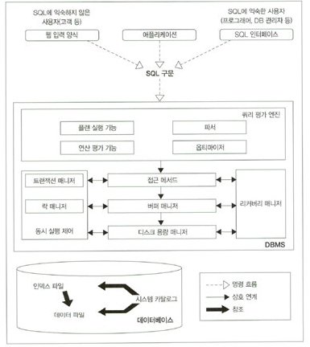
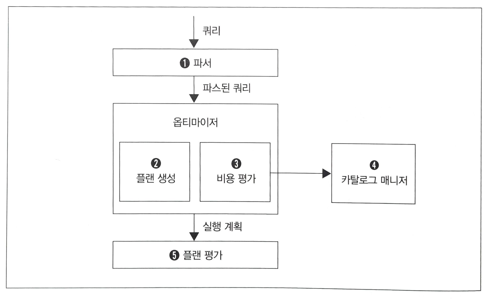
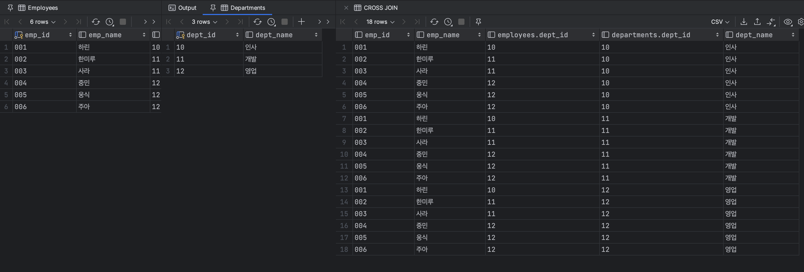
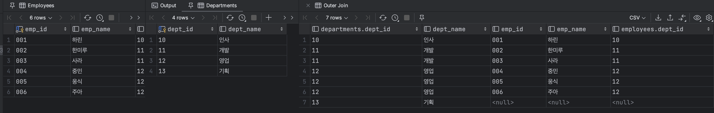
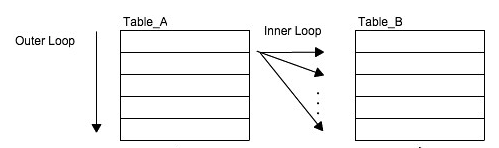
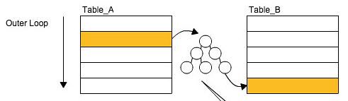
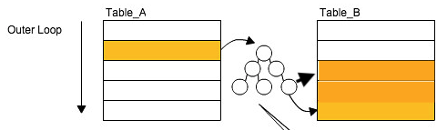
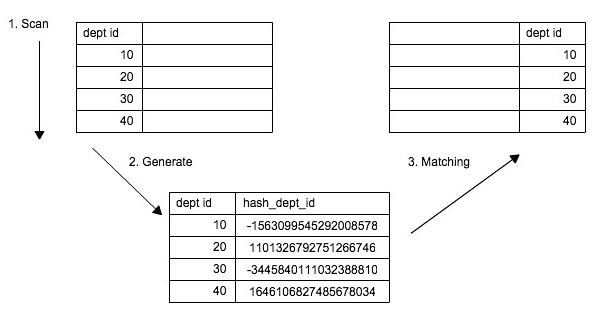
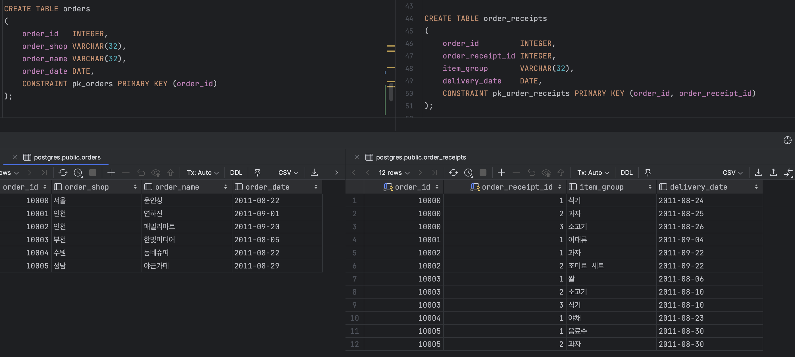
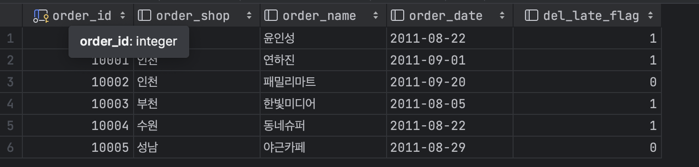

> 해당 글은 [SQL 레벨업](https://www.aladin.co.kr/shop/wproduct.aspx?ItemId=75566292#8968482519_CommentReview)을 베이스로 정리한 내용입니다.

## DBMS Architecture



---

## 버퍼(Buffer)

DBMS는 데이터를 저장을 목적으로 하는 미들웨어이기에 기억장치와 밀접한 연관을 가지고 있다.

주로 사용하는 메모리와 디스크의 접근 속도 차이가 매우 크다. 따라서, 일반적인 SQL 구문의 실행 시간 대부분을 I/O에 사용하는 상황에서 디스크 접근을 줄이는 것이 성능 향상을 가져온다.

이 때, 성능 향상을 목적으로  데이터를 저장하는 메모리를 `Buffer` 혹은 `Cahce` 라고 한다.

이러한 Buffer에 `데이터를 어떻게, 어느 정도 기간 동안 올릴지`를 관리하는 것이 DBMS의 `Buffer Manager`이다.

DB에서 데이터를 유지하기 위해 사용하는 메모리를 크게 두 분류로 나눌 수 있다.

### 데이터 캐시(Data Cache)

데이터 캐시는 데이터를 메모리에 유지하는데 사용하는 영역이며 SELECT할 데이터가 데이터 캐시에 있다면 빠르게 찾을 수 있다. 아니라면 낮은 속도의 저장소에 접근이 일어나 성능이 떨어진다.

### 로그 버퍼(Log Buffer)

주로 갱신(INSERT, UPDATE, DELETE, MERGE)과 관련이 있다. 갱신 처리를 사용자가 보내면 우선 로그 버퍼에 변경 정보를 보내고 후에 디스크에 커밋을 수행한다.

따라서 SQL 실행 시점과 실제 저장소 갱신 시점에 차이가 있는 비동기 처리이다.

```
메모리는 휘발성 저장소인데 DBMS가 죽으면 어떻게 될까? (Todo:다시 알아봐야 함)

데이터캐시는 별 문제가 없다. 데이터가 영속적으로 저장된 저장소에서 다시 읽으면 되기 때문이다.
하지만 로그버퍼의 경우 로그버퍼에 변경 정보를 보내고 아직 갱신하기 전이라면 중요 정보들이 반영되지 않을 문제가 있다.
이를 해결하기 위해 갱신 정보를 디스크의 로그파일에 기록해두어 장애가 발생해도 정합성을 유지할 수 있게 한다.
다만, 로그파일에 기록해두는 것이 동기 방식이라 성능 저하가 이루어진다.

```

```
데이터 캐시와 로그 버퍼의 크기

DBMS에서 제공하는 기본 설정은 데이터 캐시가 로그 버퍼보다 더 크다.
이는 DB가 검색에 더 중점을 두었기 때문이다. 따라서, 사용자가 검색에 비해 갱신비중이 더 높다면 성능이 잘 나오지 않아 튜닝을 고려해야 할 수 있다.
```

```
데이터베이스의 캐시 알고리즘은 어떤 것을 사용할까?

기본적인 알고리즘은 LRU(Least Recently Used)이다. OS 스케쥴러 등 많은 곳에서 사용되는 이 알고리즘은 최근에 가장 적게 사용된 데이터를 버리는 알고리즘이다. 가장 최근에 많이 사용된 데이터만 캐시에 남으므로 캐시 히트율이 높다.
```

---

## 실행 계획 (Explain Plan)

DBMS의 쿼리 처리 흐름은 다음과 같다.



### 카탈로그 매니저 (Catalog Manager)

옵티마이저가 실행 계획을 세울 때 중요한 정보(테이블 또는 인덱스 통계 정보 등)를 제공하는 역할을 가지고 있다.

### 옵티마이저 (Optimizer)

저장소에 있는 데이터에 어떻게 접근할 것인가에 대한 실행 계획을 세우고 최적의 실행 계획을 선택하는 것이 옵티마이저의 역할이다.

카탈로그 정보가 부정확한 경우 옵티마이저가 최적의 실행 계획을 만들지 못하는 상황이 발생한다.  이는 카탈로그 정보가 갱신되지 않으면 발생되는 문제인데 이를 JIT(Just In Time)으로 해결하는 경우도 있지만 비용 소모가 매우 크다는 단점이 있다.

---

## 결합 (Join)

### 종류

조인은 다음과 같이 나눌 수 있다.

- 크로스 조인 (Cross Join)
- 이너 조인 (Inner Join)
- 아우터 조인 (Outer Join)
- 셀프 조인 (Self Join)
  - 물리적으로 같은 테이블을 조인하는 연산
- 등가 & 비등가 조인 (Equi & Non-Equi Join)
  - 결합 조건으로 등호(=)를 사용하는지 부등호(>, >=)를 사용하는지 차이
- 네츄럴 조인 (Natural Join)
  - 따로 결합 조건을 기술하지 않고, 암묵적으로 같은 이름의 필드를 등호로 결합하는 조인

여기서 크로스, 이너, 아우터 조인이 연산 결과 차이를 가진 조인이고 나머지는 결과가 아닌 과정의 차이이다.

#### Cross Join

크로스 조인은 데카르트 곱 혹은 카티션 프로덕트라는 연산이다.

따라서 모든 경우의 수를 구하는 연산이라고 할 수 있다. Employees 6개 레코드, Departments 3개 레코드이므로 18개 레코드을 결과로 얻을 수 있다.



하지만 모든 경우의 수를 구하는 것은 사용처도 많지 않으며 비용이 매우 크다는 단점이 있다.

#### Inner Join

이너 조인은 조건으로 준 컬럼의 데이터 값이 같은 레코드를 결합한 결과를 보여주는 연산이다.

연산 결과를 보면 위 크로스 조인의 결과의 부분 집합이라는 것을 알 수 있다. Inner 라는 단어가 위 카티션 프로덕트의 부분 집합이라는 의미에서 나온 단어이다.


#### Outer Join

아우터 조인은 카티션 프로덕트의 부분 집합이 아닌 결과를 의미한다. (다만, 부분 집합인 결과도 데이터 상태에 따라 존재할 수 있다.)

```sql
SELECT *
FROM Departments
         LEFT OUTER JOIN Employees ON Departments.dept_id = Employees.dept_id;
```

아래는 위 쿼리의 결과이다.



LEFT, RIGHT의 차이는 왼쪽이 마스터 테이블이냐 오른쪽이 마스터 테이블이냐의 차이이다.

위 결과는 왼쪽이(Departments) 마스터 테이블이기 때문에 Departments에 있고 Employees에 없는 데이터는 null로 출력되고 있다.

이 예외 레코드가 카티션 프로덕트 결과에 포함되지 않은 'Outer'라는 의미이다. 

---

### 결합 알고리즘과 성능

알고리즘 종류

- NL (Nested Loops)
- Hash
- Sort Merge

알고리즘의 선택 여부는 `데이터의 크기` `결합키의 분산` 두 가지에 의존한다.

#### NL (Nested Loops)



자주 접할 수 있는 이중 반복문과 같은 알고리즘이다. 기준이 되는 테이블(위 사진 기준 Table_A)을 외부(구동) 테이블, 다른 테이블을 내부 테이블이라고 한다.

- 시간 복잡도 O(NM)
- 한 번의 단계에서 처리하는 레코드 수가 적어 Hash, Sort Merge에 비해 메모리 소비가 적다.
- 모든 DBMS에서 지원

여기서 중요한 점은 NM, MN의 수행 시간이 달라질 수 있다는 점이다. 일반적으로 외부 테이블이 더 작으면 더 빠른 성능을 가진다.

단,  `외부 테이블의 크기가 더 작고` & ` 내부 테이블과의 결합키 필드에 인덱스가 존재` 해야  더 빠른 수행 시간을 얻을 수 있다.



내부 테이블의 결합키 필드에 인덱스가 존재한다면 내부 테이블 전체를 순회할 필요없이 해당 데이터에 빠르게 접근할 수 있기 때문이다.

순회가 완전하게 없어지는 상황은 결합 키가 내부 테이블에 유일(Unique)한 경우이다. 유일하지 않다면 여러 데이터가 히트되기 때문에 완전히 없앨 수는 없다.



이 히트되는 데이터가 너무 많다면 기대 이하의 성능이 발생할 수 있다. 예를 들어, 가게와 주문 관계에서 가게의 특정 주문을 조회하는 경우를 생각해보면 주문량이 많은 가게를 조회할 때와 주문량이 적은 가게를 조회할 때의 성능이 균등하지 않게 나온다.

이런 경우, 외부 테이블을 주문으로 잡으면 항상 하나의 레코드로 접근하도록 수행되므로 성능을 균등하게 가져갈 수 있다. 또 다른 해결 방법은 `Hash`이다.

#### Hash

해시는 유일성과 균일성을 가진 값을 출력하는 함수이다.

동작 원리는 다음과 같다.

1. 작은 테이블에서 결합키를 해싱하여 해시 테이블을 생성한다.
2. 큰 테이블의 결합키를 해싱하여 해시 테이블에 매칭하는 방식으로 조인한다.




NL과 비교해 단점은 다음과 같다.

- 해시 테이블을 사용하므로 메모리 사용량이 크고 메모리 부족으로 저장소를 이용하면 성능 저하가 올 수 있다.
- 해시값은 부등호 연산이 수행되는 경우 사용할 수 없다.
- 양쪽 테이블 레코드를 전부 읽어야하므로 풀스캔이 주로 사용된다.

Hash를 사용하는 것이 좋은 경우는 다음과 같다.

- 적절한 외부 테이블(상대적으로 작은 테이블)이 없는 경우
- 적절한 외부 테이블은 있지만 내부 테이블에서 히트되는 레코드가 많은 경우
- 내부 테이블에 인덱스가 없는 경우

따라서 NL을 효율적으로 수행하기 어려운 상황에서 Hash를 고려해야 한다.

#### Sort Merge

Sort Merge는 결합 대상 테이블들을 각 결합키로 정렬하고 일치하는 결합키를 찾으면 결합하는 방식이다.

따라서 다음과 같은 특징이 있다.

- 양쪽 테이블을 모두 정렬해야 하므로 NL, Hash보다 메모리 사용량이 높다. (Hash는 데이터 양에 따라 다름)
- 부등호를 사용할 수 있다.
- 결합키가 이미 정렬되어 있는 경우, 정렬을 생략할 수 있다.
- 테이블을 정렬하므로 한쪽 테이블을 모두 스캔한 시점에 결합을 완료할 수 있다.

따라서 결합키가 이미 정렬되어 있지 않은 경우 NL, Hash를 우선적으로 고려해야 한다.

#### 알고리즘 비교

| 이름              | 장점                                                         | 단점                                                         |
| :---------------- | ------------------------------------------------------------ | ------------------------------------------------------------ |
| NL (Nested Loops) | - 메모리 소비가 적어 OLTP에 적합.<br />- 외부 테이블이 작고 내부 테이블이 인덱스가 있는 경우 빠르다.<br />- 비등가 결합 가능 | - 대규모 테이블 결합에 부적합<br />- 내부 테이블에 인덱스를 타지 않거나 히트 데이터가 많으면 느리다. |
| Hash              | - 대규모 테이블 결합에 적합                                  | - 메모리 소비가 커 OLTP에 부적합<br />- 등가 결합만 가능     |
| Sort Merge        | - 대규모 테이블 결합에 적합<br />- 비등가 결합 가능          | - 메모리 소비가 커 OLTP에 부적합 <br />- 결합키가 정렬되어 있지 않으면 비효율 |

* 대규모 테이블 == 결합 대상 레코드의 규모가 큰 테이블

### 마무리

- 조인은 SQL 성능 문제의 주된 원인
- 결합 알고리즘을 선택할 수 있는 DB가 있으나 외부 요인(테이블 크기 증감)을 예측하기 힘들어 지양해야 한다. 대신 조인을 효율적으로, 적게 수행하는 것이 중요

## 서브쿼리 (Subquery)

### 개념 정리

서브쿼리란 SQL 내부에서 작성되는 일시적인 테이블이다.

이와 비슷한 개념이 뷰(View), 테이블(Table)인데 각 차이는 다음과 같다.

테이블 : 영속적인 데이터 저장

뷰 : 영속적이나 데이터를 저장하지 않음. 매 호출시 SELECT 쿼리를 실행

서브쿼리 : 비영속적인 생존 기간이 SQL 구문 실행 중으로 한정

### 단점

기능적으로는 위 방법이 차이가 없지만 성능적으로 차이가 있다.

- 연산 비용이 추가된다. 서브쿼리도 쿼리이므로 영속적이지 않다. 따라서 SELECT 구문을 매번 실행해야 한다.
- 데이터 I/O가 비용이 발생한다. 연산 결과를 보통 메모리에 저장하고 있는데 메모리가 부족할 경우 저장소를 사용해야 하며 성능이 떨어진다.
- 최적화를 할 수 없다. 테이블은 영속적이며 인덱스 같은 최적화를 수행할 수 있지만 서브쿼리는 제약, 인덱스를 사용할 수 없다.
- 결합을 필요로 하는 경우, 비용이 높고 실행 계획 변동 리스크가 존재한다.

대신 서브쿼리의 결과가 조인(결합) 대상 레코드 크기를 감소시키는 경우에서는 성능이 더 좋을 수 있다.

SQL 성능을 결정하는 요인은 I/O가 매우 크다. 따라서 불필요한 서브쿼리 사용을 지양해야 하며 윈도우 함수의 사용을 우선적으로 생각해보면 좋을 것이다.

---

## 갱신(Update)과 데이터 모델

### 갱신이 가져오는 트레이드오프



위와 같이 주문(orders), 주문 안에 명세(order_receipts) 테이블이 있다.

여기서 주문일(order_date)와 배송 예정일(delivery_date)의 차이가 3일 이상인 경우 알림을 보낼 기능을 만드려고 한다.

첫 번째 방법은 쿼리를 통해 대상을 조회하는 것이다.

```sql
SELECT o.order_id,
       o.order_name,
       MAX(orc.delivery_date - o.order_date) AS diff_days
FROM orders o
         INNER JOIN order_receipts orc
                    ON o.order_id = orc.order_id
WHERE orc.delivery_date - o.order_date >= 3
GROUP BY o.order_id;
```

하지만 이 방법은 집약과 결합을 수행해야 하므로 테이블의 크기가 커졌을 때 비용 소모가 커질 것이다.

두 번째 방법은 모델 갱신을 사용하는 방법이다.



배송 지연 플래그(del_late_flag)를 추가하는 데이터 모델을 갱신 작업을 통해 간단한 조회를 이용해 원하는 정보를 얻을 수 있다.

다만 여기에는 세 가지 문제가 있다.

- 높아지는 갱신 비용

  - 삽입 시점에 데이터가 들어가는 것이 아닌 추후 배송 예정일이 나온 이후에 갱신을 수행해야하기 때문에 갱신 비용이 추가된다.

    (검색 부하 -> 갱신 부하)

- 갱신까지의 시간 랙(Time Rag) 발생

  - (주문 등록 -> 주문 명세 등록 -> )  주문 명세 갱신 -> 주문 갱신이 실시간 동기화되지 않으므로 랙이 발생한다.

    만약 주문 명세 갱신과 주문 갱신을 동일 트랜잭션으로 묶어 실시간성을 지원한다면 성능과의 트레이드 오프가 심할 것이다.

- 모델 갱신 비용

  - 코드 수정에 비해 기존 데이터 모델 갱신은 커다란 리스크를 가져온다.

### 마무리

점차 쿼리 작성에 익숙해지다보면 모든 문제를 쿼리만을 이용해 풀려할 수 있다. 

하지만 데이터 모델을 잘못 작성하면 문제를 비효율적으로 해결할 수 밖에 없는 상황이 올 수 있다. 

초기에 데이터 모델을 설계하는 것이 중요하고 쿼리만이 아닌 데이터 모델을 수정하는 것 또한 좋은 방법이 될 수 있다.

더 넓은 시야를 가지고  문제 해결을 하는 습관을 가져야 한다.

## 인덱스 (Index)

### 인덱스로 효율적인 성능 향상을 하려면

인덱스에 대한 선택 기준은 카디널리티와 선택률이다.

카디널리티가 높은 필드는 모든 레코드에 다른 값이 들어가 있는 Unique 필드이다. 반면, 모든 레코드에 같은 값이 들어가있으면 카디널리티가 낮은 필드이다.

선택률은 특정 필드값을 지정했을 때 해당 테이블에서 몇 개의 레코드가 선택되는지를 나타내는 개념이다.

(Ex. 테이블의 레코드가 100개인 테이블에 기본키 필드의 특정 값을 지정하면 오직 1개가 나온다. 선택률 1/100 = 1%)

따라서 카디널리티가 높을수록, 선택률이 낮을수록(10% 미만) 더 좋은 인덱스 후보가 된다.

### 인덱스로 성능 향상이 어려운 경우

#### 레코드를 제대로 압축하지 못하는 경우

##### Case1

```sql
SELECT order_id, receive_date
FROM orders
WHERE flag = '5';
```

만약 위 flag 필드가
1 - 200만개

2 - 500만개

3 - 500만개

4 - 500만개

5 - 1억개

위와 같이 이루어져있다고 하면 선택률이 매우 높으므로 풀스캔이 차라리 더 나을 수 있다.

##### Case2

```sql
SELECT order_id
FROM orders
WHERE receive_date BETWEEN :start_date AND :end_date;
```

날짜를 검색 조건으로 받을 때, 검색 조건이 하루라면 선택률이 매우 낮을 수 있다.

하지만 검색 조건이 1년이 된다면 1일에 비해 365배가 될 수 있다.

##### Case3

```sql
SELECT COUNT(*)
FROM orders
WHERE shop_id = :sid;
```

작은 가게(1만건)와 큰 가게(1000만건)는 주문량이 다를 수 밖에 없다.

큰 가게의 선택률이 높기 때문에 오히려 인덱스 스캔이 성능 악화를 일으킨다.

### 인덱스를 사용하지 않는 검색 조건

#### 중간 일치, 후방 일치의 LIKE 연산자

```sql
SELECT order_id
FROM orders
WHERE shop_name LIKE '%대공원%';
```

중간 일치 연산을 이용해 범위를 더욱 좁힐 수 있다. 하지만 중간 일치(%이름%), 후방 일치(%이름)의 경우 인덱스를 타지 않는다.

#### 색인 필드의 연산

```sql
SELECT *
FROM table
WHERE index_col * 1.1 > 100;
```

인덱스 컬럼을 연산한 결과는 당연히 인덱스 테이블에는 존재하지 않는다. 따라서 인덱스를 타지 않는다.

```sql
SELECT *
FROM table
WHERE index_col > 100 / 1.1
```

이와 같이 연산의 순서를 바꿔 사용하자.

#### IS NULL & 함수

NULL과 관련한 검색 조건에서 인덱스가 사용되지 않는다.

```sql
SELECT *
FROM table
WHERE index_col IS NULL;
```

```sql
SELECT *
FROM table
WHERE LENGTH(index_col) = 10;
```

함수를 사용하는 경우도 마찬가지이다.

#### 부정형 사용하는 경우

부정형(<>, !=, NOT IN)은 인덱스를 사용할 수 없다.

### 인덱스를 사용할 수 없는 경우 대처법

#### 외부 설정으로 처리

UI 설계를 이용하면 기간 검색에 대한 조건을 얻을 수 있다. 

예를 들어 검색을 할 때, 항상 기간을 입력하도록 강제한다고 하자. 그리고 검색 기간은 최대 1개월이라고 조건을 준다면 기간 검색에서도 인덱스를 잘 활용할 가능성이 커진다.

인덱스 설계는 SQL과 테이블 정의만 보고는 할 수 없다. 이와 같이 애플리케이션의 기능과 조건에 크게 의존하기 때문이다.

#### 데이터 마트에 의한 처리

데이터 마트는 개요 테이블(Summary Table)이라고도 한다. 특정한 쿼리에서 필요한 데이터만 저장하는 상대적으로 작은 크기의 테이블을 의미한다. 원래 테이블의 부분 집합이라고도 볼 수 있다. 매우 많은 정보를 가지고 있는 유저 로그 테이블이 있다고 한다면 데이터 마트 중 하나로 유저의 구매 패턴 통계 테이블을 예로 들 수 있겠다. (예를 들어 그렇다는거다.)

데이터량이 확 적어지기 때문에 압축 조건이 없어서 성능을 보장할 수 있다.

다만 데이터 마트를 사용할 때는 몇가지 주의점이 있다.

- 데이터 신선도
  - 데이터의 동기 시점과 관련된 문제이다. 데이터 마트는 원본 테이블을 이용해서 만들기 때문에 데이터를 지속적으로 동기화해야 한다. 문제는 동기화 사이클이 길면 신선도가 떨어지고 짧으면 신선도가 높지만 갱신 부하가 커진다.
- 데이터 마트 크기
  - 데이터 마트가 원본 테이블에 비해 획기적으로 크기를 줄일 수 없는 경우(모든 필드를 검색하거나, 조건의 선택률 큰 경우)에는 사용하기 어렵다. GROUP BY를 이용해 데이터를 크게 줄여 집계하는 방법을 사용하여 개선할 수 있다. 
- 데이터 마트 수
  - 데이터 마트도 커다란 원본 테이블을 이용해 만들기 때문에 상대적으로 작다는 것이지 많아지면 부담이 될 수 있다. 또한, 기능이 생길 때마다 마트를 만든다면 추후 관리가 불가능해지는 경우가 있을 수 있다.

### 인덱스 온리 스캔

접근하려는 대상의 I/O 감소를 목적으로 한다는 점에서는 데이터 마트와 같다. 대신 동기화 문제를 해결할 수 있다는 장점이 있다.

갱신 파트에서 사용한 orders 테이블을 예시로 들면

```sql
SELECT order_id, order_date
FROM orders
```

이 쿼리에서는 항상 풀 스캔을 사용했다.

```sql
CREATE INDEX idx_order_id_date ON orders (order_id, order_date)
```

하지만 조회 대상 필드로 결합 인덱스를 만든다면 더 이상 테이블이 아닌 인덱스 테이블을 대상으로 스캔을 하게 된다. (인덱스 온리 스캔)

인덱스 온리 스캔에도 몇가지 주의점이 있다.

- 한 개의 인덱스에 포함할 수 있는 필드 수에 제한이 있다.
  - 인덱스의 크기는 무제한이 아니고 크기에 제한이 있다. 또한 인덱스가 너무 커지면 I/O를 줄이겠다는 목적을 잃는다.
- 갱신 오버 헤드가 커진다.
- 정기적인 인덱스 리빌드가 필요
  - 인덱스의 일부만 읽어들이는 레인지 스캔과는 달리 인덱스 온리 스캔은 인덱스 풀스캔을 한다. 따라서 성능이 인덱스의 크기에 비례한다. 따라서 인덱스의 크기 모니터링과 리빌드를 할 필요가 생긴다.
- 더 많은 조회 대상 필드가 필요해진다면 재사용할 수 없다.
