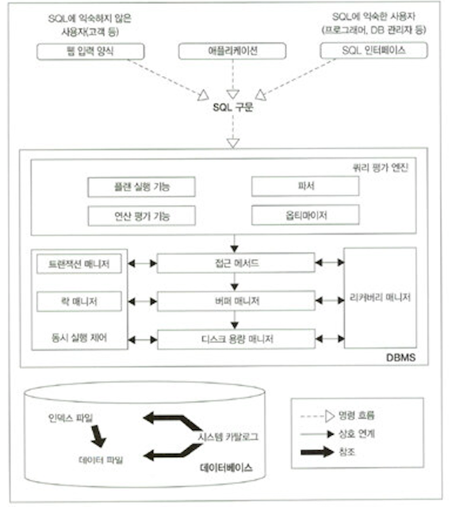
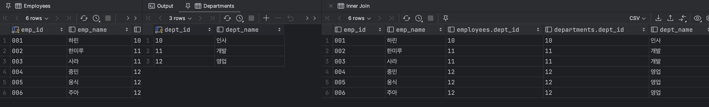
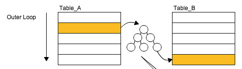

> 해당 글은 [SQL 레벨업](https://www.aladin.co.kr/shop/wproduct.aspx?ItemId=75566292#8968482519_CommentReview)을 정리한 내용입니다.

# DB Architecture



---

## 버퍼(Buffer)

DBMS는 데이터를 저장을 목적으로 하는 미들웨어이기에 기억장치와 밀접한 연관을 가지고 있다.

주로 사용하는 메모리와 디스크의 접근 속도 차이가 매우 크다. 따라서, 일반적인 SQL 구문의 실행 시간 대부분을 I/O에 사용하는 상황에서 디스크 접근을 줄이는 것이 성능 향상을 가져온다.

이 때, 성능 향상을 목적으로  데이터를 저장하는 메모리를 `Buffer` 혹은 `Cahce` 라고 한다.

이러한 Buffer에 `데이터를 어떻게, 어느 정도 기간 동안 올릴지`를 관리하는 것이 DBMS의 `Buffer Manager`이다.

DB에서 데이터를 유지하기 위해 사용하는 메모리를 크게 두 분류로 나눌 수 있다.

### 데이터 캐시(Data Cache)

데이터 캐시는 데이터를 메모리에 유지하는데 사용하는 영역이며 SELECT할 데이터가 데이터 캐시에 있다면 빠르게 찾을 수 있다. 아니라면 낮은 속도의 저장소에 접근이 일어나 성능이 떨어진다.

### 로그 버퍼(Log Buffer)

주로 갱신(INSERT, UPDATE, DELETE, MERGE)과 관련이 있다. 갱신 처리를 사용자가 보내면 우선 로그 버퍼에 변경 정보를 보내고 후에 디스크에 커밋을 수행한다.

따라서 SQL 실행 시점과 실제 저장소 갱신 시점에 차이가 있는 비동기 처리이다.

```
메모리는 휘발성 저장소인데 DBMS가 죽으면 어떻게 될까? (Todo:다시 알아봐야 함)

데이터캐시는 별 문제가 없다. 데이터가 영속적으로 저장된 저장소에서 다시 읽으면 되기 때문이다.
하지만 로그버퍼의 경우 로그버퍼에 변경 정보를 보내고 아직 갱신하기 전이라면 중요 정보들이 반영되지 않을 문제가 있다.
이를 해결하기 위해 갱신 정보를 디스크의 로그파일에 기록해두어 장애가 발생해도 정합성을 유지할 수 있게 한다.
다만, 로그파일에 기록해두는 것이 동기 방식이라 성능 저하가 이루어진다.

```

```
데이터 캐시와 로그 버퍼의 크기

DBMS에서 제공하는 기본 설정은 데이터 캐시가 로그 버퍼보다 더 크다.
이는 DB가 검색에 더 중점을 두었기 때문이다. 따라서, 사용자가 검색에 비해 갱신비중이 더 높다면 성능이 잘 나오지 않아 튜닝을 고려해야 할 수 있다.
```

```
데이터베이스의 캐시 알고리즘은 어떤 것을 사용할까?

기본적인 알고리즘은 LRU(Least Recently Used)이다. OS 스케쥴러 등 많은 곳에서 사용되는 이 알고리즘은 최근에 가장 적게 사용된 데이터를 버리는 알고리즘이다. 가장 최근에 많이 사용된 데이터만 캐시에 남으므로 캐시 히트율이 높다.
```

---

## 실행 계획 (Explain Plan)

DBMS의 쿼리 처리 흐름은 다음과 같다.


### 카탈로그 매니저 (Catalog Manager)

옵티마이저가 실행 계획을 세울 때 중요한 정보(테이블 또는 인덱스 통계 정보 등)를 제공하는 역할을 가지고 있다.

### 옵티마이저 (Optimizer)

저장소에 있는 데이터에 어떻게 접근할 것인가에 대한 실행 계획을 세우고 최적의 실행 계획을 선택하는 것이 옵티마이저의 역할이다.

카탈로그 정보가 부정확한 경우 옵티마이저가 최적의 실행 계획을 만들지 못하는 상황이 발생한다.  이는 카탈로그 정보가 갱신되지 않으면 발생되는 문제인데 이를 JIT(Just In Time)으로 해결하는 경우도 있지만 비용 소모가 매우 크다는 단점이 있다.

---

## 결합 (Join)

### 종류

조인은 다음과 같이 나눌 수 있다.

- 크로스 조인 (Cross Join)
- 이너 조인 (Inner Join)
- 아우터 조인 (Outer Join)
- 셀프 조인 (Self Join)
  - 물리적으로 같은 테이블을 조인하는 연산
- 등가 & 비등가 조인 (Equi & Non-Equi Join)
  - 결합 조건으로 등호(=)를 사용하는지 부등호(>, >=)를 사용하는지 차이
- 네츄럴 조인 (Natural Join)
  - 따로 결합 조건을 기술하지 않고, 암묵적으로 같은 이름의 필드를 등호로 결합하는 조인

여기서 크로스, 이너, 아우터 조인이 연산 결과 차이를 가진 조인이고 나머지는 결과가 아닌 과정의 차이이다.

#### Cross Join

크로스 조인은 데카르트 곱 혹은 카티션 프로덕트라는 연산이다.

따라서 모든 경우의 수를 구하는 연산이라고 할 수 있다. Employees 6개 레코드, Departments 3개 레코드이므로 18개 레코드을 결과로 얻을 수 있다.


하지만 모든 경우의 수를 구하는 것은 사용처도 많지 않으며 비용이 매우 크다는 단점이 있다.

#### Inner Join

이너 조인은 조건으로 준 컬럼의 데이터 값이 같은 레코드를 결합한 결과를 보여주는 연산이다.

연산 결과를 보면 위 크로스 조인의 결과의 부분 집합이라는 것을 알 수 있다. Inner 라는 단어가 위 카티션 프로덕트의 부분 집합이라는 의미에서 나온 단어이다.



#### Outer Join

아우터 조인은 카티션 프로덕트의 부분 집합이 아닌 결과를 의미한다. (다만, 부분 집합인 결과도 데이터 상태에 따라 존재할 수 있다.)

```sql
SELECT *
FROM Departments
         LEFT OUTER JOIN Employees ON Departments.dept_id = Employees.dept_id;
```

아래는 위 쿼리의 결과이다.


LEFT, RIGHT의 차이는 왼쪽이 마스터 테이블이냐 오른쪽이 마스터 테이블이냐의 차이이다.

위 결과는 왼쪽이(Departments) 마스터 테이블이기 때문에 Departments에 있고 Employees에 없는 데이터는 null로 출력되고 있다.

이 예외 레코드가 카티션 프로덕트 결과에 포함되지 않은 'Outer'라는 의미이다. 

---

### 결합 알고리즘과 성능

알고리즘 종류

- Nested Loops
- Hash
- Sort Merge

알고리즘의 선택 여부는 `데이터의 크기` `결합키의 분산` 두 가지에 의존한다.

#### Nested Loops


자주 접할 수 있는 이중 반복문과 같은 알고리즘이다. 기준이 되는 테이블(위 사진 기준 Table_A)을 외부(구동) 테이블, 다른 테이블을 내부 테이블이라고 한다.

- 시간 복잡도 O(NM)
- 한 번의 단계에서 처리하는 레코드 수가 적어 Hash, Sort Merge에 비해 메모리 소비가 적다.
- 모든 DBMS에서 지원

여기서 중요한 점은 NM, MN의 수행 시간이 달라질 수 있다는 점이다. 일반적으로 외부 테이블이 더 작으면 더 빠른 성능을 가진다.

단,  `외부 테이블의 크기가 더 작고` & ` 내부 테이블과의 결합키 필드에 인덱스가 존재` 해야  더 빠른 수행 시간을 얻을 수 있다.



내부 테이블의 결합키 필드에 인덱스가 존재한다면 내부 테이블 전체를 순회할 필요없이 해당 데이터에 빠르게 접근할 수 있기 때문이다.

순회가 완전하게 없어지는 상황은 결합 키가 내부 테이블에 유일(Unique)한 경우이다. 유일하지 않다면 여러 데이터가 히트되기 때문에 완전히 없앨 수는 없다.


이 히트되는 데이터가 너무 많다면 기대 이하의 성능이 발생할 수 있다. 예를 들어, 가게와 주문 관계에서 가게의 특정 주문을 조회하는 경우를 생각해보면 주문량이 많은 가게를 조회할 때와 주문량이 적은 가게를 조회할 때의 성능이 균등하지 않게 나온다.

이런 경우, 외부 테이블을 주문으로 잡으면 항상 하나의 레코드로 접근하도록 수행되므로 성능을 균등하게 가져갈 수 있다. 또 다른 해결 방법은 `Hash`이다.

