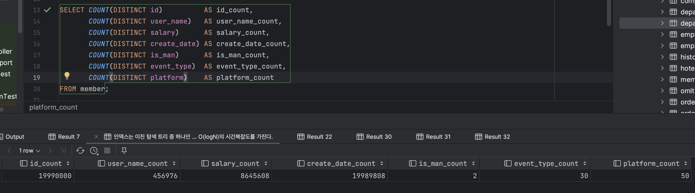

# 인덱스 성능

인덱스란 조회 성능을 높히기 위한 자료구조이다.

하지만 단순히 인덱스를 생성한다고 조회 성능을 최대로 얻을 수는 없다. 인덱스를 고려하지 않은 쿼리는 조회 성능은 얻지 못한채 저장소만 차지하고 있을 수 있다.

그러므로 인덱스 성능을 얻는 방법과 인덱스를 사용하지 못하는 예제들에  대해 알아보며 성능을 개선하는 것에 대해 알아보겠다.

---

## 테스트 데이터

```sql
CREATE TABLE member
(
    id          VARCHAR(255) PRIMARY KEY,
    user_name   VARCHAR(255) NOT NULL,
    salary      INTEGER      NOT NULL,
    create_date TIMESTAMP    NOT NULL,
    is_man      BOOLEAN      NOT NULL DEFAULT FALSE,
    event_type  INTEGER      NOT NULL,
    platform    VARCHAR(255) NOT NULL
);
```

테스트 데이터는 약 2000만건으로 생성했다.

각 컬럼의 카디널리티는 다음과 같다.



---

## 인덱스 선택 기준

인덱스에 대한 선택 기준은 카디널리티와 선택률이다.

카디널리티가 높은 필드는 모든 레코드에 다른 값이 들어가 있는 Unique 필드이다. 반면, 모든 레코드에 같은 값이 들어가있으면 카디널리티가 낮은 필드이다.

선택률은 특정 필드값을 지정했을 때 해당 테이블에서 몇 개의 레코드가 선택되는지를 나타내는 개념이다.

(Ex. 테이블의 레코드가 100개인 테이블에 기본키 필드의 특정 값을 지정하면 오직 1개가 나온다. 선택률 1/100 = 1%)

따라서 카디널리티가 높을수록, 선택률이 낮을수록(10% 미만) 더 좋은 인덱스 후보가 된다.

---

## 결합 인덱스와 단일 인덱스

결합 인덱스는 여러 필드가 하나의 인덱스를 이루는 것이고 단일 인덱스는 하나의 필드가 하나의 인덱스를 이루는 것이다. 

그렇다면 두 개의 필드를 묶어 결합 인덱스를 만드는 것과 단일 인덱스 2개를 만드는 것은 뭐가 다를까?

만일 검색 조건으로 A, B 필드가 사용되고 A 필드의 선택률이 낮다고 가정하면 다음과 같이 동작한다.

- 결합 인덱스 AB

  AB 인덱스를 스캔해 데이터를 찾는다.

- 단일 인덱스 A, B

  선택률이 낮은 A 필드로 인덱스 스캔을 진행하고 필터링된 데이터셋을 풀스캔하여 데이터를 찾는다.

물론 DBMS 내부적으로 다르긴 하겠으나 이런 식으로 접근하면 좋다.

아래와 같은 쿼리로 단일 인덱스, 결합 인덱스를 테스트해보았다. (인덱스 제거 후 생성)

```sql
SELECT *
FROM member
WHERE event_type = 13 AND platform = 30;

-- 단일 인덱스
CREATE INDEX idx_member_event_type ON member (event_type);
CREATE INDEX idx_member_platform ON member (platform);
-- 결합 인덱스
CREATE INDEX idx_user_name_event_type ON member (user_name, event_type);
```

단일 인덱스의 경우, 평균적으로 2400ms 정도가 소요되었다.

```sql
+-------------------------------------------------------------------------------------------------------------------------------------------------+
|QUERY PLAN                                                                                                                                       |
+-------------------------------------------------------------------------------------------------------------------------------------------------+
|Bitmap Heap Scan on member  (cost=11569.76..54499.62 rows=13238 width=61) (actual time=112.308..2150.448 rows=13329 loops=1)                     |
|  Recheck Cond: (((platform)::text = '30'::text) AND (event_type = 13))                                                                          |
|  Rows Removed by Index Recheck: 12527277                                                                                                        |
|  Heap Blocks: exact=20999 lossy=154311                                                                                                          |
|  ->  BitmapAnd  (cost=11569.76..11569.76 rows=13238 width=0) (actual time=109.593..109.594 rows=0 loops=1)                                      |
|        ->  Bitmap Index Scan on idx_member_platform  (cost=0.00..4345.94 rows=399134 width=0) (actual time=47.165..47.166 rows=400082 loops=1)  |
|              Index Cond: ((platform)::text = '30'::text)                                                                                        |
|        ->  Bitmap Index Scan on idx_member_event_type  (cost=0.00..7216.95 rows=663002 width=0) (actual time=58.401..58.401 rows=667060 loops=1)|
|              Index Cond: (event_type = 13)                                                                                                      |
|Planning Time: 1.279 ms                                                                                                                          |
|Execution Time: 2152.130 ms                                                                                                                      |
+-------------------------------------------------------------------------------------------------------------------------------------------------+
```

위 실행 계획은 각 인덱스에 대해 필터링을 수행해서 나온 두 데이터셋의 교집합을 구한다는 의미이다. 따라서 풀스캔은 수행되지 않았지만 같은 테이블을 두 번 스캔하고 있다.

결합 인덱스의 경우, 평균적으로 400ms가 소요되었다.

```sql
+-----------------------------------------------------------------------------------------------------------------------------------------------+
|QUERY PLAN                                                                                                                                     |
+-----------------------------------------------------------------------------------------------------------------------------------------------+
|Bitmap Heap Scan on member  (cost=184.13..43113.98 rows=13238 width=61) (actual time=4.410..290.845 rows=13329 loops=1)                        |
|  Recheck Cond: ((event_type = 13) AND ((platform)::text = '30'::text))                                                                        |
|  Heap Blocks: exact=13011                                                                                                                     |
|  ->  Bitmap Index Scan on idx_member_event_type_platform  (cost=0.00..180.82 rows=13238 width=0) (actual time=2.803..2.803 rows=13329 loops=1)|
|        Index Cond: ((event_type = 13) AND ((platform)::text = '30'::text))                                                                    |
|Planning Time: 1.951 ms                                                                                                                        |
|Execution Time: 292.341 ms                                                                                                                     |
+-----------------------------------------------------------------------------------------------------------------------------------------------+
```

하나의 결합 인덱스 스캔을 이용해서 더 빠른 시간이 소요되는 것을 확인할 수 있다.