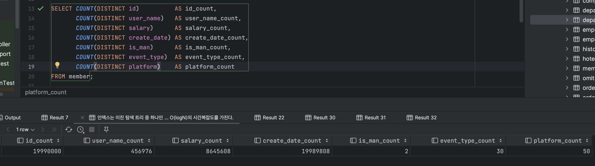

# 인덱스

인덱스란 조회 성능을 높히기 위한 자료구조이다.

하지만 단순히 인덱스를 생성한다고 조회 성능을 최대로 얻을 수는 없다. 인덱스를 고려하지 않은 쿼리는 조회 성능은 얻지 못한채 저장소만 차지하고 있을 수 있다.

그러므로 인덱스 성능을 얻는 방법과 주의 사항에 대해 알아보며 성능을 개선하는 것에 대해 알아보겠다.

---

## 테스트 데이터

```sql
CREATE TABLE member
(
    id          VARCHAR(255) PRIMARY KEY,
    user_name   VARCHAR(255) NOT NULL,
    salary      INTEGER      NOT NULL,
    create_date TIMESTAMP    NOT NULL,
    is_man      BOOLEAN      NOT NULL DEFAULT FALSE,
    event_type  INTEGER      NOT NULL,
    platform    VARCHAR(255) NOT NULL
);
```

테스트 데이터는 약 2000만건으로 생성했다.

각 컬럼의 카디널리티는 다음과 같다.



## 인덱스 선택 기준

인덱스에 대한 선택 기준은 카디널리티와 선택률이다.

카디널리티가 높은 컬럼는 모든 레코드에 다른 값이 들어가 있는 Unique 컬럼이다. 반면, 모든 레코드에 같은 값이 들어가있으면 카디널리티가 낮은 컬럼이다.

선택률은 특정 컬럼값을 지정했을 때 해당 테이블에서 몇 개의 레코드가 선택되는지를 나타내는 개념이다.

(Ex. 테이블의 레코드가 100개인 테이블에 기본키 컬럼의 특정 값을 지정하면 오직 1개가 나온다. 선택률 1/100 = 1%)

따라서 카디널리티가 높을수록, 선택률이 낮을수록(10% 미만) 더 좋은 인덱스 후보가 된다.

## 결합 인덱스와 단일 인덱스

결합 인덱스는 여러 컬럼가 하나의 인덱스를 이루는 것이고 단일 인덱스는 하나의 컬럼가 하나의 인덱스를 이루는 것이다. 

그렇다면 두 개의 컬럼를 묶어 결합 인덱스를 만드는 것과 단일 인덱스 2개를 만드는 것은 뭐가 다를까?

만일 검색 조건으로 A, B 컬럼가 사용되고 A 컬럼의 선택률이 낮다고 가정하면 다음과 같이 동작한다.

- 결합 인덱스 AB

  AB 인덱스를 스캔해 데이터를 찾는다.

- 단일 인덱스 A, B

  선택률이 낮은 A 컬럼로 인덱스 스캔을 진행하고 필터링된 데이터셋을 풀스캔하여 데이터를 찾는다.

물론 DBMS 내부적으로 다르긴 하겠으나 이런 식으로 접근하면 좋다.

아래와 같은 쿼리로 단일 인덱스, 결합 인덱스를 테스트해보았다. (인덱스 제거 후 생성)

```sql
SELECT *
FROM member
WHERE event_type = 13 AND platform = 30;

-- 단일 인덱스
CREATE INDEX idx_member_event_type ON member (event_type);
CREATE INDEX idx_member_platform ON member (platform);
-- 결합 인덱스
CREATE INDEX idx_user_name_event_type ON member (user_name, event_type);
```

단일 인덱스의 경우, 평균적으로 2400ms 정도가 소요되었다.

```sql
+-------------------------------------------------------------------------------------------------------------------------------------------------+
|QUERY PLAN                                                                                                                                       |
+-------------------------------------------------------------------------------------------------------------------------------------------------+
|Bitmap Heap Scan on member  (cost=11569.76..54499.62 rows=13238 width=61) (actual time=112.308..2150.448 rows=13329 loops=1)                     |
|  Recheck Cond: (((platform)::text = '30'::text) AND (event_type = 13))                                                                          |
|  Rows Removed by Index Recheck: 12527277                                                                                                        |
|  Heap Blocks: exact=20999 lossy=154311                                                                                                          |
|  ->  BitmapAnd  (cost=11569.76..11569.76 rows=13238 width=0) (actual time=109.593..109.594 rows=0 loops=1)                                      |
|        ->  Bitmap Index Scan on idx_member_platform  (cost=0.00..4345.94 rows=399134 width=0) (actual time=47.165..47.166 rows=400082 loops=1)  |
|              Index Cond: ((platform)::text = '30'::text)                                                                                        |
|        ->  Bitmap Index Scan on idx_member_event_type  (cost=0.00..7216.95 rows=663002 width=0) (actual time=58.401..58.401 rows=667060 loops=1)|
|              Index Cond: (event_type = 13)                                                                                                      |
|Planning Time: 1.279 ms                                                                                                                          |
|Execution Time: 2152.130 ms                                                                                                                      |
+-------------------------------------------------------------------------------------------------------------------------------------------------+
```

위 실행 계획은 각 인덱스에 대해 필터링을 수행해서 나온 두 데이터셋의 교집합을 구한다는 의미이다. 따라서 풀스캔은 수행되지 않았지만 같은 테이블을 두 번 스캔하고 있다.

결합 인덱스의 경우, 평균적으로 400ms가 소요되었다.

```sql
+-----------------------------------------------------------------------------------------------------------------------------------------------+
|QUERY PLAN                                                                                                                                     |
+-----------------------------------------------------------------------------------------------------------------------------------------------+
|Bitmap Heap Scan on member  (cost=184.13..43113.98 rows=13238 width=61) (actual time=4.410..290.845 rows=13329 loops=1)                        |
|  Recheck Cond: ((event_type = 13) AND ((platform)::text = '30'::text))                                                                        |
|  Heap Blocks: exact=13011                                                                                                                     |
|  ->  Bitmap Index Scan on idx_member_event_type_platform  (cost=0.00..180.82 rows=13238 width=0) (actual time=2.803..2.803 rows=13329 loops=1)|
|        Index Cond: ((event_type = 13) AND ((platform)::text = '30'::text))                                                                    |
|Planning Time: 1.951 ms                                                                                                                        |
|Execution Time: 292.341 ms                                                                                                                     |
+-----------------------------------------------------------------------------------------------------------------------------------------------+
```

하나의 결합 인덱스 스캔을 이용해서 더 빠른 성능을 얻을 수 있는 것을 확인할 수 있다.

## 결합 인덱스를 사용할 때 주의할 점

결합 인덱스를 생성하고 쿼리 조건으로 결합 인덱스에 속한 컬럼를 다 준다고해서 최적의 속도를 얻는 것은 아니다. 몇 가지 주의할 점이 있다.

### 결합 인덱스 첫 번째 컬럼은 쿼리 조건에 포함해야 한다.

인덱스를 구성하는 컬럼을 모두 쿼리 조건에 포함해야만 하는 것은 아니다. 일부만 포함하더라도 인덱스를 사용할 수 있다. 다만 항상 그런 것은 아닌데 인덱스를 구성하는 첫 번째 컬럼은 꼭 포함해야 한다는 조건이 있다.

```sql
CREATE INDEX idx_member_user_name_event_type_platform ON member (user_name, event_type, platform);
```

```sql
-- event_type 제외
SELECT *
FROM member
WHERE user_name = 'vuhb'
  AND platform = '30';
  
-- user_name 제외
SELECT *
FROM member
WHERE platform = '39'
  AND event_type = 10;
```

위 쿼리의 실행 계획은 다음과 같다.

```sql
-- event_type 제외
+------------------------------------------------------------------------------------------------------------------------------------------------+
|QUERY PLAN                                                                                                                                      |
+------------------------------------------------------------------------------------------------------------------------------------------------+
|Index Scan using idx_member_user_name_event_type_platform on member  (cost=0.56..9.02 rows=1 width=61) (actual time=0.062..0.064 rows=1 loops=1)|
|  Index Cond: (((user_name)::text = 'vuhb'::text) AND ((platform)::text = '39'::text))                                                          |
|Planning Time: 0.104 ms                                                                                                                         |
|Execution Time: 0.112 ms                                                                                                                        |
+------------------------------------------------------------------------------------------------------------------------------------------------+
```

```sql
-- user_name 제외
+-----------------------------------------------------------------------------------------------------------------------------+
|QUERY PLAN                                                                                                                   |
+-----------------------------------------------------------------------------------------------------------------------------+
|Gather  (cost=1000.00..374052.60 rows=13241 width=61) (actual time=19.712..1289.541 rows=13385 loops=1)                      |
|  Workers Planned: 2                                                                                                         |
|  Workers Launched: 2                                                                                                        |
|  ->  Parallel Seq Scan on member  (cost=0.00..371728.50 rows=5517 width=61) (actual time=12.953..1222.615 rows=4462 loops=3)|
|        Filter: (((platform)::text = '39'::text) AND (event_type = 10))                                                      |
|        Rows Removed by Filter: 6658872                                                                                      |
|Planning Time: 0.550 ms                                                                                                      |
|JIT:                                                                                                                         |
|  Functions: 6                                                                                                               |
|  Options: Inlining false, Optimization false, Expressions true, Deforming true                                              |
|  Timing: Generation 2.718 ms, Inlining 0.000 ms, Optimization 3.114 ms, Emission 28.031 ms, Total 33.863 ms                 |
|Execution Time: 1292.342 ms                                                                                                  |
+-----------------------------------------------------------------------------------------------------------------------------+
```

event_type을 제외한 경우에는 user_name, platform 컬럼를 통해 인덱스를 타는 것을 확인할 수 있었으나, user_name을 제외했을 때는 풀스캔을 사용했다.

이는 인덱스가 첫 번째 컬럼이 정렬된 것 기준으로 두 번째 컬럼이 정렬되는 방식으로 이루어진 것(이후 컬럼도 마찬가지)과 연관이 있다. 즉, 두 번째 컬럼은 첫 번재 컬럼에 의존한다는 의미인데 앞에 어떤 값이 올지를 모르니 두 번째 컬럼을 인덱스로 탈 수가 없다.

> 물론 event_type을 제외한 경우에도 user_name으로 한 번 필터링을 하고 event_type 컬럼에 대해 조건이 없으니 풀스캔을 수행한 이후에 platform 컬럼을 사용할 것이기 때문에 모든 컬럼을 조건으로 주는 것보다는 성능이 떨어진다.

### 인덱스 구성 컬럼의 순서와 성능에 연관이 있다.

인덱스를 구성할 컬럼 순서를 선정할 때는 카디널리티가 높은 순서대로 구성하는 것이 좋다.

인덱스를 이루고 있는 컬럼 순서대로 필터링을 진행하기 때문에 앞쪽 필터를 통해 많은 데이터를 걸러낼 수 있다면 다음 필터에서 스캔해야 할 데이터들이 빠르게 줄어들기 때문이다.

## 인덱스를 사용하지 않는 검색 조건

쿼리 조건으로 인덱스 컬럼를 포함한다고 해서 무조건 인덱스를 타지는 않는다.

### 인덱스를 사용하지 않는 검색 조건

#### 인덱스 컬럼의 연산

```sql
SELECT *
FROM table
WHERE index_col * 1.1 > 100;
```

인덱스 컬럼을 연산한 결과는 당연히 인덱스 테이블에는 존재하지 않는다. 따라서 인덱스를 타지 않는다.

```sql
SELECT *
FROM table
WHERE index_col > 100 / 1.1
```

이와 같이 연산의 순서를 바꿔 사용하자.

```sql
SELECT *
FROM table
WHERE LENGTH(index_col) = 10;
```

함수를 사용하는 경우도 마찬가지이다.

#### NULL

```sql
SELECT *
FROM table
WHERE index_col IS NULL;
```

NULL과 관련한 검색 조건에서 인덱스가 사용되지 않는다.

NULL 값은 인덱스에 저장되지 않기 때문이다.

#### 부정형

부정형(<>, !=, NOT IN)은 인덱스를 사용할 수 없다.

동등형의 경우에는 정렬된 데이터를 비교해가며 범위를 좁혀 나갈 수 있다. 부정형의 경우에는 값이 일치하지 않는지를 모두 확인해야 하기 때문에 풀스캔이 필요하다.

#### 중간 일치, 후방 일치의 LIKE 연산자

```sql
SELECT order_id
FROM orders
WHERE shop_name LIKE '%대공원%';
```

중간 일치(%이름%), 후방 일치(%이름)의 경우 인덱스를 타지 않는다. 

부정형과 비슷하게 전방 일치의 경우에는 정렬된 순서를 이용해 문자열 앞부분부터 확인해가며 범위를 좁힐 수 있다. 하지만 중간, 후방 일치의 경우에는 앞부분에 어떤 값이 들어오는 지도 확인해야 하기 때문에 풀스캔이 필요하다.

#### OR 연산 (vs IN)

OR 연산의 경우엔 LIKE 연산의 중간일치와 같이 앞뒤 조건이 모두 참이어야 한다. 따라서 모든 경우를 확인해야 하기 때문에 인덱스를 사용할 수 없다. (앞 뒤가 모두 다른 컬럼일 경우)

반면 IN 조건은 개념적으로는 거의 동일한 연산이다. 대신 IN을 여러개의 OR가 아닌 여러개의 `=` 연산의 연속이라고 생각으로 접근해야 한다.

```sql
SELECT *
FROM member
WHERE id = 'b67b0d90-c142-404b-9cfa-af50000f860c' OR id = '22e5fb41-9999-44e0-a279-1d472473bae9';

SELECT *
FROM member
WHERE id IN ('b67b0d90-c142-404b-9cfa-af50000f860c', '22e5fb41-9999-44e0-a279-1d472473bae9');
```

```sql
+--------------------------------------------------------------------------------------------------------------------------------------------+
|QUERY PLAN                                                                                                                                  |
+--------------------------------------------------------------------------------------------------------------------------------------------+
|Bitmap Heap Scan on member  (cost=9.14..17.15 rows=2 width=61) (actual time=4.767..4.769 rows=2 loops=1)                                    |
|  Recheck Cond: (((id)::text = 'b67b0d90-c142-404b-9cfa-af50000f860c'::text) OR ((id)::text = '22e5fb41-9999-44e0-a279-1d472473bae9'::text))|
|  Heap Blocks: exact=1                                                                                                                      |
|  ->  BitmapOr  (cost=9.14..9.14 rows=2 width=0) (actual time=4.758..4.759 rows=0 loops=1)                                                  |
|        ->  Bitmap Index Scan on member_pkey  (cost=0.00..4.57 rows=1 width=0) (actual time=3.454..3.455 rows=1 loops=1)                    |
|              Index Cond: ((id)::text = 'b67b0d90-c142-404b-9cfa-af50000f860c'::text)                                                       |
|        ->  Bitmap Index Scan on member_pkey  (cost=0.00..4.57 rows=1 width=0) (actual time=1.302..1.303 rows=1 loops=1)                    |
|              Index Cond: ((id)::text = '22e5fb41-9999-44e0-a279-1d472473bae9'::text)                                                       |
|Planning Time: 0.101 ms                                                                                                                     |
|Execution Time: 4.824 ms                                                                                                                    |
+--------------------------------------------------------------------------------------------------------------------------------------------+
```

```sql
+------------------------------------------------------------------------------------------------------------------------+
|QUERY PLAN                                                                                                              |
+------------------------------------------------------------------------------------------------------------------------+
|Index Scan using member_pkey on member  (cost=0.56..17.16 rows=2 width=61) (actual time=0.061..0.075 rows=2 loops=1)    |
|  Index Cond: ((id)::text = ANY ('{b67b0d90-c142-404b-9cfa-af50000f860c,22e5fb41-9999-44e0-a279-1d472473bae9}'::text[]))|
|Planning Time: 0.313 ms                                                                                                 |
|Execution Time: 0.089 ms                                                                                                |
+------------------------------------------------------------------------------------------------------------------------+
```

실행 계획을 확인해봐도 OR 연산은 각 값에 따라 인덱스 스캔을 2번 수행하고 합연산을 진행하는 반면 IN의 경우 인덱스 스캔을 한 번 수행하는 것을 확인할 수 있다.

또한 IN을 사용하는 것이 OR와 비교해 다음과 같은 장점이 있다.

- 서브쿼리를 이용한 유연한 확장
- IN은 하나의 컬럼으로만 비교하는 것과 달리 OR는 여러 컬럼을 비교할 수 있다. 따라서 인덱스 사용 자체가 불가능해질 수 있다.

#### 범위 조건

between, like, <, > 등 Range scan(범위 스캔)은 해당 컬럼은 인덱스를 타지만, 뒤 컬럼은 결합 인덱스 유무와 관계 없이 인덱스로 사용하지 않는다.

> 이 내용은 범위 데이터의 경우 불연속적 데이터이기 때문에 인덱스로 사용되지 못하는 것 같은데 정확하게 이유를 이해하진 못하였다. 인덱스 스캔을 전혀 못할 것 같진 않은데.. [구루비](http://wiki.gurubee.net/pages/viewpage.action?pageId=26740302) 이 곳에 비슷한 내용이 있긴한 것 같은데 나중에 자세히 알아보겠다.
