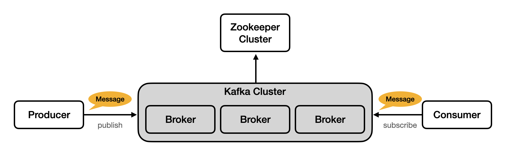
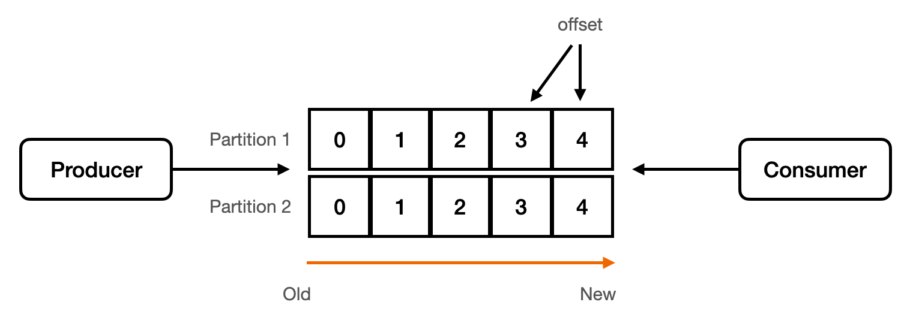
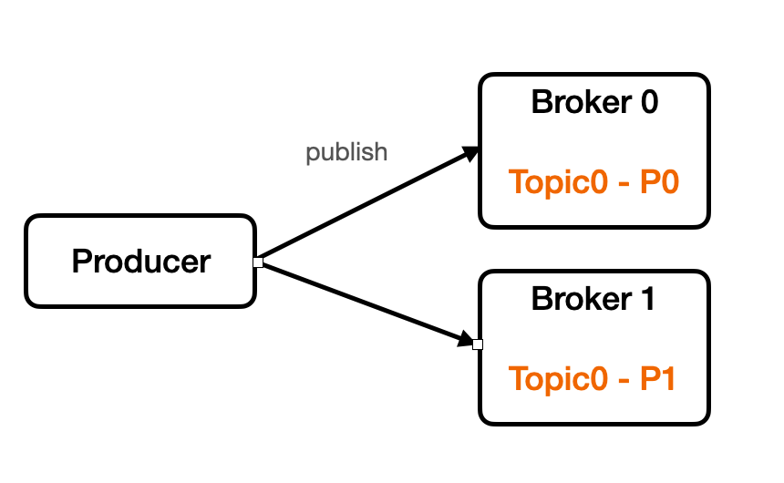
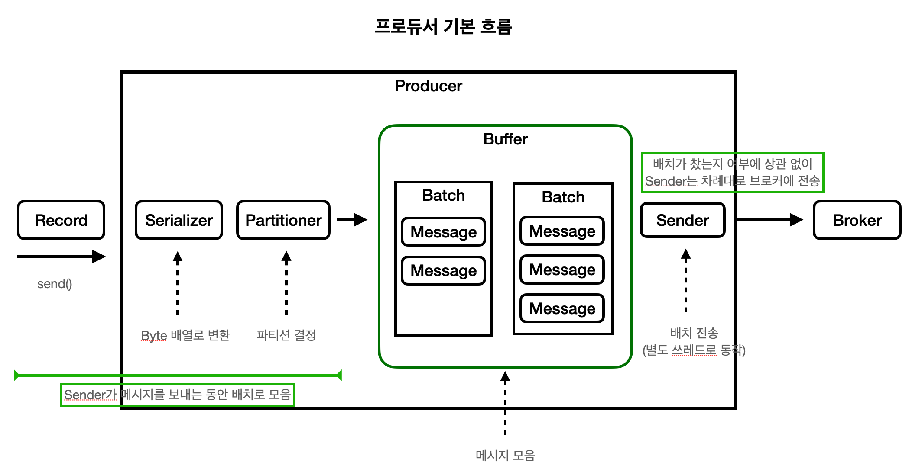
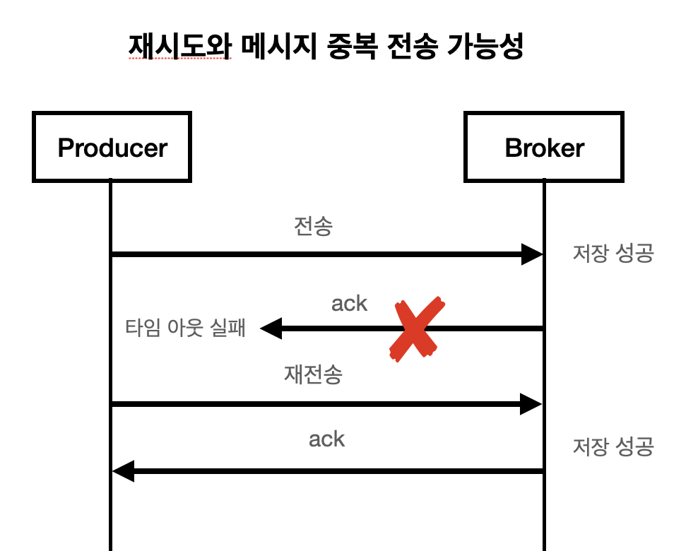
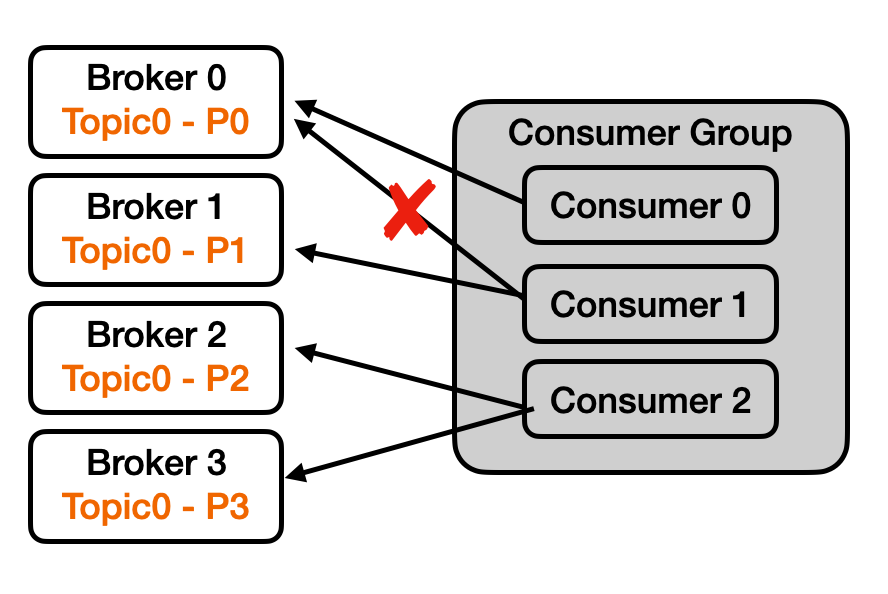
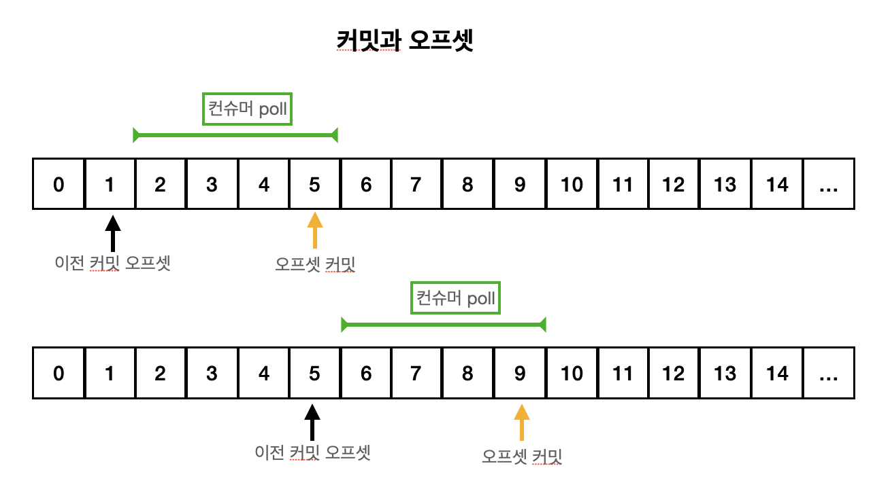

# Kafka
카프카란 오픈소스 분산 이벤트 스트리밍 플랫폼이다. 비동기 메시징을 처리하는 메시지 큐로 많이 사용된다.

발행/구독 모델(pub/sub)의 방식을 사용한다. 즉, 데이터를 전송하는 방식이 아닌 받기를 원하는 주체가 토픽(topic)을 구독함으로써 데이터를 읽어오는 방식이다.

## 구조



- Broker
  
  카프카 클러스터는 여러 개의 브로커로 이루어져 있다. 이 브로커들이 각각의 서버라고 볼 수 있다. 이 브로커들이 메시지를 나눠서 저장, 이중화, 장애 발생시 대체 등을 수행한다.
  
- Zookeeper

  카프카 클러스터를 관리하는 역할을 한다. 카프카 클러스터와 관련된 정보가 기록이 되고 관리가 된다.


- Topic

  메시지를 저장하는 단위

- Partition

  메시지를 저장하는 물리적인 파일

- Record

  파티션에 저장되는 데이터

- Producer

  카프카 클러스터에 메시지를 발행(produce)하는 역할을 한다.

- Consumer

  카프카 클러스터에서 메시지를 읽는(consume) 역할을 한다.

## Topic & Partition

토픽은 메세지를 저장하는 단위를 의미한다. 

여러 가지 메시지가 있을 때 이 메시지들을 구분하기 위한 용도로 사용된다.

토픽은 한 개 이상의 파티션으로 구성된다. 즉, 파티션은 메시지를 저장하는 물리적인 파일을 의미한다.

- 파티션은 추가만 가능한(append only) 파일
- 각 메시지 저장 위치를 오프셋(offset)이라고 한다.
- 프로듀서가 넣은 메시지는 큐와 같이 파티션의 맨 뒤에 추가된다.
- 컨슈머는 오프셋 기준으로 메시지를 순서대로 읽는다.
- 메시지는 읽어진다고 삭제되지 않으며 설정에 따라 일정 시간이 지난 뒤에 삭제된다.



### 하나의 토픽이 여러 파티션을 구성하는 이유

**분산 처리를 통한 성능 향상에 있다.**

만약 카프카가 한 토픽의 모든 파티션을 하나의 브로커에 넣을 경우, 해당 토픽의 확장성은 브로커의 I/O 처리량에 의해 제약된다. 파티션들을 여러 브로커에 나눔으로써, 하나의 토픽은 수평적으로 확장될 수 있고 이로 인해 브로커의 처리 능력보다 더 큰 성능을 제공할 수 있게 된다.

토픽은 여러 Consumer 에 의해 동시에 처리될 수 있다. 단일 브로커에서 모든 파티션을 제공하면 지원할 수 있는 Consumer 수가 제약되는데, 여러 브로커에서 파티션을 나누어 제공함으로써 더 많은 Consumer 들이 동시에 토픽의 메시지를 처리할 수 있게 된다.

동일한 Consumer 의 여러 인스턴스가 서로 다른 브로커에 있는 파티션에 접속함으로써 매우 높은 메시지 처리량을 가능케 한다. 각 Consumer 인스턴스는 하나의 파티션에서 메시지를 제공받고, 각각의 레코드는 명확한 처리 담당자가 존재함을 보장할 수 있다.

## Record

파티션 안에 프로듀서가 보낸 데이터가 존재하는데 이것을 **`레코드(Record)`** 라고 한다.

- 레코드는 **`타임스탬프`**, **`메세지 키`**, **`메세지 값`**, **`오프셋`**, **`헤더`**로 구성되어 있고, 프로듀서가 생성한 레코드가 브로커로 전송되면 오프셋과 타임스탬프가 지정되어 저장된다.
- 브로커에 한번 적재된 레코드는 수정할 수 없고 **`로그 리텐션 기간 또는 용량`**에 따라서만 삭제된다.
- 메세지 키는 메세지 값을 순서대로 처리하거나 메세지 값의 종류를 나타내기 위해 사용한다.
  - **`메세지 키를 사용하면 프로듀서가 토픽에 레코드를 전송할 때 메세키 키의 해시값을 토대로 파티션을 지정한다.`**
  - **`즉, 메세지 키를 지정하면 동일한 파티션에 들어가게 된다. 다만, 어떤 파티션에 지정될지는 모르고 파티션의 개수가 변경되면 메세지 키와 파티션 매칭이 달라지게 되므로 주의해야 한다.`**
- 메세지 키와 메세지 값은 직렬화되어 브로커로 전송되기 때문에 컨슈머가 이용할 때는 직렬화한 형태와 동일한 형태로 역직렬화를 해야 한다.

## Producer

카프카 클러스터에 메시지를 발행(produce)하는 역할을 한다.

라운드 로빈(round-robin) 또는 키를 이용해 저장할 파티션을 선택해서 저장한다.

키 방식의 경우, 프로듀서가 카프카에 메시지를 전송할 때 토픽뿐만 아니라 키를 지정할 수 있다. 이 때, 키의 해시값을 이용해 저장할 토픽을 선택한다. 같은 키에 대해서는 메시지 순서가 유지된다.



#### 흐름



프로듀서 애플리케이션에서 send() 메소드를 통해 메시지를 보내면 직렬화 -> 파티션 결정 -> 메시지 배치 적재 -> Sender 순으로 전송된다.

Buffer에 메시지를 적해하는 쓰레드와 Sender로 메시지를 전송하는 쓰레드는 별도의 쓰레드다. 따라서 Sender가 보낼때 메시지가 적재하지 못한다던가 메시지가 적재될 때 Sender가 전송을 하지 못하는 문제는 발생하지 않는다.

#### 주요 설정

프로듀서와 관련된 주요 설정은 다음이 있다.

- batch.size

  배치 크기. 배치가 다 차면 전송한다.

  batch.size가 너무 작으면 한 번에 처리할 수 있는 데이터가 너무 적어지므로 처리량이 감소한다.

- linger.ms

  전송 대기 시간(기본값 O)

  linger.ms 설정으로 어느 정도 대기 시간을 가진 후에 배치를 처리하므로 한 번에 처리할 수 있는 메시지가 늘어 처리량이 증가한다.

- max.block.ms

  주요 속성은 아닌데 send()로 데이터를 전송할 때, buffer.memory 값을 초과하는 경우 딜레이가 발생한다.

  프로듀서가 브로커에 전송하는 속도보다 버퍼에 더 빠르게 쌓일 경우 max.block.ms 시간만큼 send() 요청을 블로킹한다.

#### 전송 결과 확인

전송 결과를 확인하는 방법은 3가지가 있다.

- 전송 결과를 확인하지 않음

  ```java
  producer.send(new ProducerRecord<>("key", "value"));
  ```

  전송 실패를 알 수 없으며 별도 처리가 필요 없는 메시지 전송에 사용한다.

- 전송 결과를 확인함 - Future

  ```jade
  Future<RecordMetadata> f = producer.send(new ProducerRecord<>("key", "value"));
  try {
  	RecordMetadata meta = f.get(); // 블로킹
  } catch (ExecutionException ex) {
  	// 처리
  }
  ```

  블로킹 방식을 사용하기 때문에 배치 효과가 떨어져 처리량이 저하된다.

- 전송 결과를 확인함 - Callback

  ```java
  producer.send(new ProducerRecord<>("key", "value")),
  	new Callback() {
  		@Override
  		public void onCompletion(RecordMetadata metadata, Exception ex) {
  			// 처리
  		}
  	});
  ```

  처리량 저하가 없는 논블로킹 방식

#### 전송 보장과 ack

- ack = 0

  - 서버 응답 대기 x
  - 전송 보장 0

- ack = 1

  - 파티션의 리더에 저장되면 응답을 받는다.
  - 리더가 받아 응답을 보내고 팔로워에 저장되지 않은 상태에서 리더에 장애가 생기면 데이터가 유실될 수 있다.

- ack = all (-1)

  - 모든 리플리카에 저장되면 응답을 받는다.

  - min.insync.replicas (브로커 옵션)

    프로듀서 ack 옵션이 all일 때 저장에 성공할 수 있다고 응답할 수 있는 동기화된 리플리카 최소 개수

    Ex. min.insync.replicas = 2이고 리플리카가 3개라면 리더, 팔로워 1개에 저장되면 정상 응답을 보낸다.

    ​	값을 1로 설정한것과 ack = 1로 설정한 것은 같은 것이다.

    > 값을 리플리카 개수와 똑같이 설정하면 안된다.
    >
    > 리플리카 중 한개라도 장애가 나면 항상 실패를 리턴하기 때문이다.

#### 에러 유형

- 전송 과정에서 실패
  - 전송 타임 아웃(일시적인 네트워크 오류 등)
  - 리더 다운에 의한 새 리더 선출 진행 중
  - 브로커 설정 메시지 크기 한도 초과 등
- 전송 전에 실패
  - 직렬화 실패, 프로듀서 자체 요청 크기 제한 초과
  - 프로듀서 버퍼가 차서 기다린 시간이 최대 대기 시간 초과 등

#### 실패 대응 1 : 재시도

- 재시도
  - 재시도 가능한 에러는 재시도 처리
    - 예: 브로커 응답 타임 아웃, 일시적인 리더 없음 등
- 재시도 위치
  - 프로듀서는 기본적으로 자체적으로 브로커 전송 과정에서 에러가 발생하면 재시도 가능한 에러에 대해 재전송 시도
    - `retries` 속성
  - `send()` 메서드에서 **Exception** 발생시 **Exception** 타입에 따라 `send()` 재호출
  - 콜백 메서드에서 **Exception** 받으면 타입에 따라 `send()` 재호출
- 특별한 이유가 없다면 무한 재시도 X
  - 다음 보내야할 메시지가 밀리는 것임
  - 재시도를 일정시간이나 일정횟수로 제한을 해서 전체적인 메시지가 밀리지 않도록 주의해야함

#### 실패 대응 2 : 기록

- 추후 재처리 위해 기록
  - 별도 파일, DB 등을 이용해서 실패한 메시지 기록
  - 추후에 수동(또는 자동) 보정 작업 진행
- 기록 위치
  - `send()` 메서드에서 **Exception** 발생시
  - `send()` 메서드에 전달한 콜백에서 **Exception** 받는 경우
  - `send()` 메서드가 리턴한 `Future`의 `get()` 메서드에서 **Exception** 발생시

#### 재시도와 메시지 중복 전송 가능성



브로커 응답이 늦게 와서 재시도할 경우 중복 발생 가능성이 있다.

enable.idempotence 속성을 이용하여 개선 가능

#### 재시도와 순서

- max.in.flight.requests.per.connection

  - 블로킹없이 한 커넥션에서 전송할 수 있는 최대 전송중인 요청 개수

  - 이 값이 1보다 크면 재시도 시점에 따라 메시지 순서가 바뀔 수 있음 

    - 전송 순서가 중요하면 이 값을 1로 지정

    전송 순서 1 2 3 -> 중간에 1 실패 후 재전송 -> 도착 순서 2 3 1

    

## Consumer

카프카 클러스터에서 메시지를 읽는(consume) 역할을 한다.

#### Consumer Group

컨슈머는 컨슈머 그룹에 속하며 한 개 파티션은 컨슈머 그룹의 한 개 컨슈머에만 연결 가능하다.

즉, 컨슈머 그룹에 속한 컨슈머는 파티션을 공유할 수 없으며 하나의 컨슈머 그룹 내에서는 파티션의 메시지가 순차적으로 처리됨을 보장한다.



위 그림을 예로 보면, 컨슈머 0에서 이미 연결했기 때문에 컨슈머 1은 파티션 0과 연결할 수 없다. 컨슈머 2는 파티션 2, 3과 연결된 것처럼 하나의 컨슈머가 여러 파티션과 연결할 수 있다.

크게 세 가지 케이스로 나눌 수 있다.

- 파티션 > 컨슈머

  파티션이 컨슈머 개수보다 많은 경우에는 각 파티션과 컨슈머가 매칭이 되고 컨슈머 중에 하나가 나머지 파티션과 추가적으로 매핑이 될 것이다.

- 파티션 == 컨슈머

  파티션이 컨슈머 개수와 같은 경우는 각 파티션과 컨슈머가 1:1로 매칭이 될 것이다. 가장 이상적인 상황이다.

- 파티션 < 컨슈머

  파티션보다 컨슈머 개수가 많다면 1:1로 매칭이 된 후 남은 컨슈머는 놀게 된다. 이 상황은 피해야 한다.

컨슈머 그룹이 존재하는 이유는 여러 개의 파티션에서 병렬로 데이터를 읽게 되어 빠른 처리가 가능하다는 부분도 있겠지만, 특정 컨슈머에서 문제가 생겼을 때 그룹내 다른 컨슈머가 대신 읽을 수 있도록 리밸런싱되어 장애 상황을 대처할 수 있다는 부분도 있다.

#### Commit & Offset



컨슈머는 커밋된 오프셋으로 어떤 레코드부터 읽어야 할 지를 확인하고 가져온다.

읽어온 레코드를 처리한 후에는 자동 혹은 수동 커밋을 통해 오프셋을 커밋한다.

커밋을 수행하기 전 읽어온 레코드 처리에 실패했을 때는 아래 내용을 우선 고려해보는 것이 좋다.
- 메시지를 다시 읽어와서 처리할 건지
- 실패한 메시지를 다른 곳에 보관하고 후처리로 복구할지
- 멱등성으로 처리 가능한지

오프셋과 관련된 설정 중 `auto.offset.reset` 설정이 있는데 토픽에 새로운 컨슈머 그룹이 추가되거나 하는 경우처럼 커밋한 오프셋이 없는 경우 어떻게 처리할지를 설정하는 것이다.

- `auto.offset.reset`
  - `earliest`: 맨 처음 오프셋 사용
  - `latest`: 가장 마지막 오프셋 사용 (기본값)
  - `none`: 컨슈머 그룹에 대한 이전 커밋이 없으면 **Exception** 발생

위 설정에 대한 자세한 내용은 [번외. auto.commit.reset 알아보기](https://github.com/BEOMKING/Study/blob/main/Kafka/번외.%20auto.commit.reset%20알아보기.md)를 참고하자.

#### 주요 설정

- `auto.offset.reset`
  [Commit & Offset](#Commit-&-Offset) 참조

- `fetch.min.bytes`

  브로커가 요청을 받았을 때, 서버가 반환해야 하는 최소 데이터 크기이다.

  즉, 데이터가 이 값만큼 쌓이지 않으면 쌓이길 기다린다. (`fetch.max.wait.ms`만큼 기다렸다가 전송한다.)

  - 기본값: 1B
  - 이 값이 크면 더 많은 메시지를 한 번에 가져오지만 작은 메시지를 대기해야 한다.

- `fetch.max.wait.ms`

  브로커가 요청을 받았을 때, `fetch.min.bytes` 값만큼 데이터가 쌓이지 않았으면 대기하는 최대 시간이다.

  즉, 데이터가 쌓이지 않았으면 쌓일 때까지 어느 정도 대기하다가 전송한다.

  - 기본값: 500ms
  - 이 값이 크면 대기 시간은 늘지만 한 번에 많은 데이터를 처리할 수 있다.

- `fetch.max.bytes`

  브로커가 요청을 받았을 때, 서버가 반환할 최대 데이터 크기이다.

  - 기본값: 52428800B == 50MiB
  - 이 값이 크면 한 번에 데이터를 많이 가져올 수 있다.

- `max.partition.fetch.bytes`

  파티션당 서버가 반환할 최대 데이터 크기이다.

  따라서 컨슈머는 `구독하는 파티션 수 * max.partition.fetch.bytes`의 값만큼 메모리를 가지고 있어야 한다.

  브로커의 `message.max.bytes` 설정의 값이 `max.partition.fetch.bytes` 보다 크고, 그 설정 값의 크기를 가지는 메시지가 브로커로 발행되어 있다면 컨슈머는 그 메시지를 구독할 수 없게 된다.

  - 기본값: 1048576B == 1MiB

- `max.poll.records`

- `enable.auto.commit`

  자동 커밋/수동 커밋

  - `true`: 일정 주기로 컨슈머가 읽은 오프셋을 커밋 (기본값)
  - `false`: 수동으로 커밋 실행

- `auto.commit.interval.ms`

  자동 커밋 주기이다. `poll()`, `close()` 메서드 호출시 자동으로 커밋이 실행된다.

  - 기본값: 5000ms

#### 동작 방식

- 카프카 브로커에서 `poll()`을 수행하면
  - Fetch 된 레코드가 존재하면
    - `max.poll.records`만큼 데이터를 가져온다.
  - 존재하지 않으면
    - `max.partition.fetch.bytes`만큼 데이터를 가져온다.

#### 자동 커밋

- [enable.auto.commit](https://kafka.apache.org/documentation/#consumerconfigs_enable.auto.commit)를 **`true`**로 설정하면 컨슈머는 `**poll()**`을 호출할 때 가장 마지막 오프셋을 자등으로 커밋한다. (비명시 오프셋 커밋이라고 할 수 있다.)
- 커밋 주기는 5초가 기본 값이며, [auto.commit.interval.ms](https://kafka.apache.org/documentation/#consumerconfigs_auto.commit.interval.ms) 옵션을 통해 조정이 가능하다.
- 커밋 주기 5초가 지나기 전, 3초가 지났을 때 컨슈머 리밸런스가 일어난다면 메세지 중복 처리가 될 수 있다.
  - ex) A, B 메세지를 소비한 후에 3초가 지난 시기에 리밸런스가 일어났다면, A, B 메세지는 소비가 되었는데 커밋이 되지 않은 상황이다. 즉, 리밸런스 후에 컨슈머가 다시 A,b 메세지를 소비하여 메세지가 중복 처리될 수 있다.)
- **`데이터 중복이나 유실을 허용하지 않는 서비스라면 자동 커밋을 사용해서는 안 된다.`**

#### 수동 커밋 : 동기/비동기 커밋

수동 커밋의 경우에도 컨슈머가 메세지를 읽어온 후에 DB에 반영한 후에 커밋할 때 메세지 중복이 발생할 수 있다.

- ex) 메세지들을 데이터베이스에 저장하는 도중에 실패하게 된다면, 마지막 커밋된 오프셋부터 메세지를 다시 가져오기 때문에 일부 메세지들은 데이터베이스에 중복으로 저장될 수 있다.

##### 동기 커밋

- 커밋에 성공하면 **Exception** 이 발생하지 않고 실패하면 **Exception** 발생
- 커밋에 실패했을 때는 **Exception** 을 **catch** 해서 알맞은 처리가 필요함

```java
ConsumerRecords<String, String> records = consumer.poll(Duration.ofSecond(1));
for (ConsumerRecord<String, String> record : records) {
  ... 처리
}
try {
  consumer.commitSync();
} catch(Exception ex) {
  // 커밋 실패시 에러 발생
}
```

##### 비동기 커밋

- 코드 자체에서 바로 실패여부를 알 수 없음
- 성공 실패 여부를 알고 싶다면 **callback**을 받아서 처리

```java
ConsumerRecords<String, String> records = consumer.poll(Duration.ofSecond(1));
for (ConsumerRecord<String, String> record : records) {
  ... 처리
}
consumer.commitAsync(); // commitAsync(OffsetCommitCallback callback)
```

#### 재처리와 순서

- 동일 메시지 조회(수신) 가능성
  - 일시적 커밋 실패, 리밸런스 등에 의해 발생
- 컨슈머는 멱등성(idempotence)을 고려해야 한다.
  - 예: 아래 메시지를 재처리 할 경우
    - 조회수 1 증가 -> 좋아요 1증가 -> 조회수 1증가
  - 단순 처리하면 조회수는 2가 아닌 4가 될 수 있음
- 데이터 특성에 따라 타임스탬프(**timestamp**), 일련 번호(**serial number**) 등을 활용

#### 세션 타임아웃(session.timeout), 하트비트(heartbeat), 최대 poll 간격

- 컨슈머는 하트비트(heartbeat)를 전송해서 연결 유지

  - 브로커는 일정 시간 컨슈머로부터 하트비트(**heartbeat**)가 없으면 컨슈머를 그룹에서 빼고 리밸런스 진행

  - 관련 설정

    - `session.timeout.ms`: 세션 타임 아웃 시간 (기본값 10초)

    - `heartbeat.interval.ms`

      하트비트 전송 주기 (기본값 3초)

      - `session.timeout.ms`의 1/3 이하 추천

- `max.poll.interval.ms`

  `poll()` 메서드의 최대 호출 간격

  이 시간이 지나도 `poll()` 하지 않으면 컨슈머를 그룹에서 빼고 리밸런스가 진행된다.
  
  만약 레코드 처리가 `max.poll.interval.ms`보다 오래 걸린다면 이 레코드는 몇 번의 중복이 발생할 것이다. (커밋 전에 리밸런싱이 일어나면 다시 컨슘) 
  이를 방지하기 위해선 로직 처리 시간을 고려하여 `max.poll.interval.ms`를 늘려야 한다.

#### 종료 처리

- 다른 쓰레드에서 `wakeup()` 메서드 호출
  - `poll()` 메서드가 **WakeupException** 발생 -> `close()` 메서드로 종료 처리

```java
KafkaConsumer<String, String> consumer = new KafkaConsumer<String, String>(prop);
consumer.subscribe(Collections.singleton("simple"));
try {
  while(조건) {
    ConsumerRecords<String, String> records = consumer.poll(Duration.ofMillis(100)); // wakeup() 호출시 Exception 발생
    ... records 처리
    try {
      consumer.commitSync();
    } catch(Exception ex) {
      e.printStackTrace();
    }
  }
} catch (Exception ex) {
  ...
} finally {
  consumer.close();
}
```

#### 주의: 쓰레드 안전하지 않음

- KafkaConsumer는 쓰레드에 안전하지 않음
  - 여러 쓰레드에서 동시에 사용하지 말 것!
  - `wakeup()` 메서드는 예외

## 성능

- 파티션 파일은 OS 페이지캐시 사용

  - 파티션에 대한 파일 IO를 메모리에서 처리
  - 서버에서 페이지 캐시를 카프카만 사용해야 성능에 유리

- Zero Copy

  - 디스크 버퍼에서 네트워크 버퍼로 직접 데이터 복사

- 컨슈머 추적을 위해 브로커가 하는 일이 비교적 단순

  - 메시지 필터, 메시지 재전송과 같은 일은 브로커가 하지 않음
    - 프로듀서, 컨슈머가 직접 해야 함
  - 브로커는 컨슈머와 파티션 간 매핑 관리

- 묶어서 보내기, 묶어서 받기 (**batch**)

  - 프로듀서: 일정 크기만큼 메시지를 모아서 전송 가능
  - 컨슈머: 최소 크기만큼 메시지를 모아서 조회 가능

  낱개 처리보다 처리량 증가

## 확장성

- 스케일-아웃에 용이한 구조를 가지고 있어서 처리량 증대(확장)가 쉬움
  - 1개 장비의 용량 한계 -> 브로커 추가, 파티션 추가
  - 컨슈머가 느림 -> 컨슈머 추가 (+파티션 추가)

## 리플리카 - 복제

- 리플리카: 파티션의 복제본
  - 복제수(**replication factor**) 만큼 파티션의 복제본이 각 브로커에 생김
- 리더와 팔로워 구성
  - 프로듀서와 컨슈머는 리더를 통해서만 메시지 처리
  - 팔로워는 리더로부터 복제
- 장애 대응
  - 리더가 속한 브로커 장애시 다른 팔로워가 리더가 됨
  - 프로듀서와 컨슈머는 새로운 리더를 통해서 메시지를 다시 처리할 수 있게 됨

## Reference

[kafka 조금 아는 척하기 시리즈](https://www.youtube.com/watch?v=0Ssx7jJJADI&list=PLwouWTPuIjUgr29uSrSkVo8PRmem6HRDE&index=3)

