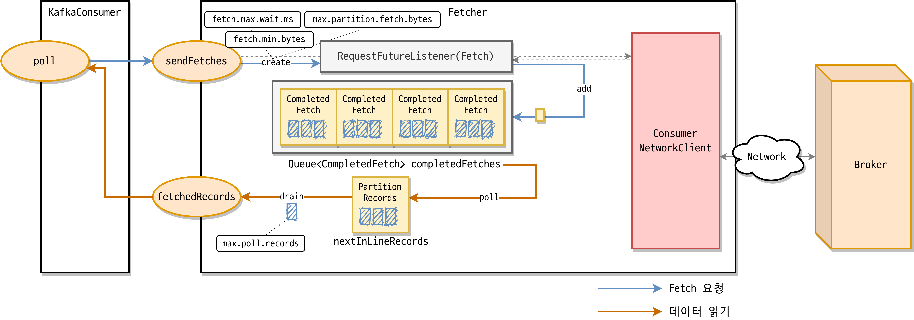

Spring Boot 기반으로 구성된 Kafka Consumer Client 애플리케이션이 어떻게 동작하는지 알아본다. 

## 목차

- [커스텀 컨슈머 구성](#커스텀-컨슈머-구성)
- [내부 동작](#내부-동작)
  - [MessageListenerContainer](#MessageListenerContainer)
  - [MessageListener](#MessageListener)
  - [@KafkaListener](#@KafkaListener)
  - [KafkaConsumer](#KafkaConsumer)
    - [ConsumerNetworkClient](#ConsumerNetworkClient)
    - [SubscriptionState](#SubscriptionState)
    - [ConsumerCoordinator](#ConsumerCoordinator)
      - [컨슈머 리밸런스](#컨슈머-리밸런스)
      - [오프셋 초기화](#오프셋-초기화)
        - [커밋된 오프셋 가져오기](#커밋된-오프셋-가져오기)
        - [파티션의 오프셋 가져오기](#파티션의-오프셋-가져오기)
        - [오프셋 커밋](#오프셋-커밋)
    - [Heartbeat](#Heartbeat)
    - [Fetcher](#Fetcher)
- [마무리](#마무리)

## 커스텀 컨슈머 구성

카프카 컨슈머 구성은 아래와 같다.

```java
@EnableKafka
@EnableConfigurationProperties(KafkaProperties.class)
@Configuration
@ConditionalOnProperty(name = "spring.kafka.consumer.enabled", havingValue = "true")
public class KafkaConsumerConfig {
    private final KafkaProperties kafkaProperties;

    public KafkaConsumerConfig(final KafkaProperties kafkaProperties) {
        this.kafkaProperties = kafkaProperties;
    }

    @Bean
    public KafkaListenerContainerFactory<ConcurrentMessageListenerContainer<String, Chat>> kafkaListenerContainerFactory() {
        final ConcurrentKafkaListenerContainerFactory<String, Chat> factory = new ConcurrentKafkaListenerContainerFactory<>();
        factory.setConsumerFactory(consumerFactory());
        factory.setBatchListener(true);
        factory.getContainerProperties().setAckMode(ContainerProperties.AckMode.MANUAL);
        factory.setConcurrency(3);
        return factory;
    }

    @Bean
    public ConsumerFactory<String, Chat> consumerFactory() {
        return new DefaultKafkaConsumerFactory<>(consumerConfig(), new StringDeserializer(), new JsonDeserializer<>(Chat.class));
    }

    @Bean
    public Map<String, Object> consumerConfig() {
        return Map.of(
                ConsumerConfig.BOOTSTRAP_SERVERS_CONFIG, kafkaProperties.getBootstrapServers(),
                ConsumerConfig.GROUP_ID_CONFIG, "chatGroupId",
                ConsumerConfig.MAX_POLL_RECORDS_CONFIG, 200,
                ConsumerConfig.AUTO_OFFSET_RESET_CONFIG, "latest",
                ConsumerConfig.ENABLE_AUTO_COMMIT_CONFIG, false
        );
    }

}
```

```java
@Slf4j
@Service
public class ChatConsumer {
    private final ChatRepository chatRepository;

    public ChatConsumer(final ChatRepository chatRepository) {
        this.chatRepository = chatRepository;
    }

    @KafkaListener(id = "chatListener1", topics = "#{'${spring.kafka.topics.chat}'.split(',')}", containerFactory = "kafkaListenerContainerFactory", autoStartup = "${spring.kafka.consumer.enabled}")
    public void recordChat(final List<Chat> chat, final Acknowledgment ack) {
        log.info("Consumed size : {}", chat.size());
        chat.forEach(chatRepository::save);
        ack.acknowledge();
    }
}
```

## 내부 동작

이 코드들이 내부적으로 어떻게 동작하는지 하향식으로 살펴본다.

### `MessageListenerContainer`

Spring에서 Kafka 메시지를 읽어오기 위해서는 Listener가 필요하다. `ConcurrentMessageListenerContainer` 클래스가 이 역할을 수행한다.

`MessageListenerContainer`는 `KafkaMessageListenerContainer`, `ConcurrentMessageListenerContainer` 두 가지 구현체를 제공한다.

- `KafkaMessageListenerContainer` 클래스
    - `KafkaConsumer`를 이용하여 Single-Thread 형태로 메시지를 읽어오는 방식
    - while (true)를 수행하면서 consumer.poll()을 통해 메시지를 읽어온다.

- `ConcurrentMessageListenerContainer` 클래스
    - Concurrency와 실제 Partition의 수에 따라 `KafaMessageListenerContainer`를 N개 생성한다.

```java
public class ConcurrentMessageListenerContainer<K, V> extends AbstractMessageListenerContainer<K, V> {
    private final List<KafkaMessageListenerContainer<K, V>> containers = new ArrayList<>();
    // 생략
```

따라서 여러 개의 Partition을 처리하기 위해서는 `ConcurrentMessageListenerContainer`를 사용하는 것이 더 낫다.

이런 ListenerContainer를 사용하는 것이 `KafkaConsumer`를 직접 사용하는 것보다 풍부한 Ack 모드 지원, 메뉴얼 토픽 파티션 어사인, 오프셋 점프, 손쉬운 스레드 세이프 관리 등의 장점이 있다.

### `MessageListener`

`MessageListener`는 크게 2가지로 나뉜다.

배치 메시지를 처리하는 `BatchMessageListener`와 단일 메시지를 처리하는 `MessageListener`가 있다.

```java
@FunctionalInterface
public interface BatchMessageListener<K, V> extends GenericMessageListener<List<ConsumerRecord<K, V>>> {
    // 생략
}
```

```java
@FunctionalInterface
public interface MessageListener<K, V> extends GenericMessageListener<ConsumerRecord<K, V>> {

}
```

특히 `BatchMessageListener`는 `poll()`을 통해 가져온 데이터를 한 번에 처리하기 때문에 여러번 호출할 필요가 줄어든다.

`BatchMessageListener`를 사용하는 부분이 아래 부분이다. 

```java
// 어노테이션 생략
public class KafkaConsumerConfig {
  // 생략
  @Bean
  public KafkaListenerContainerFactory<ConcurrentMessageListenerContainer<String, Chat>> kafkaListenerContainerFactory() {
    final ConcurrentKafkaListenerContainerFactory<String, Chat> factory = new ConcurrentKafkaListenerContainerFactory<>();
    factory.setConsumerFactory(consumerFactory());
    factory.setBatchListener(true); // 여기
    factory.getContainerProperties().setAckMode(ContainerProperties.AckMode.MANUAL);

    return factory;
  }
  // 생략
}
```

위 설정을 하면 `AbstractMessageListenerContainerFactory`의 `createListenerContainer` 메소드를 호출한다.

```java
public abstract class AbstractKafkaListenerContainerFactory<C extends AbstractMessageListenerContainer<K, V>, K, V>
		implements KafkaListenerContainerFactory<C>, ApplicationEventPublisherAware, InitializingBean,
{
  @Override
  public C createListenerContainer(KafkaListenerEndpoint endpoint) {
    C instance = createContainerInstance(endpoint);
    JavaUtils.INSTANCE
            .acceptIfNotNull(endpoint.getId(), instance::setBeanName)
            .acceptIfNotNull(endpoint.getMainListenerId(), instance::setMainListenerId);
    if (endpoint instanceof AbstractKafkaListenerEndpoint) {
      configureEndpoint((AbstractKafkaListenerEndpoint<K, V>) endpoint);
    }

    if (Boolean.TRUE.equals(endpoint.getBatchListener())) {
      endpoint.setupListenerContainer(instance, this.batchMessageConverter);
    }
    else {
      endpoint.setupListenerContainer(instance, this.recordMessageConverter);
    }
    initializeContainer(instance, endpoint);
    customizeContainer(instance);
    return instance;
  }
}
```

`KafkaListenerEndpoint` 클래스의 `setupMessageListener` 메소드를 호출하며 `BatchMessageListenerAdapter`를 생성한다.

```java
public abstract class AbstractKafkaListenerEndpoint<K, V>
		implements KafkaListenerEndpoint, BeanFactoryAware, InitializingBean 
{
    // 생략
    private void setupMessageListener(MessageListenerContainer container,
                                      @Nullable MessageConverter messageConverter) {

      MessagingMessageListenerAdapter<K, V> adapter = createMessageListener(container, messageConverter);
      JavaUtils.INSTANCE
              .acceptIfNotNull(this.replyHeadersConfigurer, adapter::setReplyHeadersConfigurer)
              .acceptIfNotNull(this.correlationHeaderName, adapter::setCorrelationHeaderName);
      adapter.setSplitIterables(this.splitIterables);
      Object messageListener = adapter;
      boolean isBatchListener = isBatchListener();
      Assert.state(messageListener != null,
              () -> "Endpoint [" + this + "] must provide a non null message listener");
      if (this.recordFilterStrategy != null) {
        if (isBatchListener) {
          if (((MessagingMessageListenerAdapter<K, V>) messageListener).isConsumerRecords()) {
            this.logger.warn(() -> "Filter strategy ignored when consuming 'ConsumerRecords' instead of a List"
                    + (this.id != null ? " id: " + this.id : ""));
          }
          else {
            messageListener = new FilteringBatchMessageListenerAdapter<>(
                    (BatchMessageListener<K, V>) messageListener, this.recordFilterStrategy, this.ackDiscarded);
          }
        }
        else {
          messageListener = new FilteringMessageListenerAdapter<>((MessageListener<K, V>) messageListener,
                  this.recordFilterStrategy, this.ackDiscarded);
        }
      }
      container.setupMessageListener(messageListener);
    }
}
```

`poll()`을 통해 가져온 데이터가 있을 때 `BatchMessageListenerAdapter` 내의 `BatchMessagingMessageConverter` 클래스의 `toMessagingMessage` 메소드를 호출한다.

```java
public class BatchMessagingMessageConverter implements BatchMessageConverter {
  @Override // NOSONAR
  public Message<?> toMessage(List<ConsumerRecord<?, ?>> records, @Nullable Acknowledgment acknowledgment,
                              Consumer<?, ?> consumer, Type type) {

    KafkaMessageHeaders kafkaMessageHeaders = new KafkaMessageHeaders(this.generateMessageId,
            this.generateTimestamp);
    
    // 생략
    
    for (ConsumerRecord<?, ?> record : records) {
      payloads.add(obtainPayload(type, record, conversionFailures));
      keys.add(record.key());
      topics.add(record.topic());
      partitions.add(record.partition());
      offsets.add(record.offset());
      if (record.timestampType() != null) {
        timestampTypes.add(record.timestampType().name());
      }
      timestamps.add(record.timestamp());
      if (this.headerMapper != null && record.headers() != null) {
        Map<String, Object> converted = new HashMap<>();
        this.headerMapper.toHeaders(record.headers(), converted);
        convertedHeaders.add(converted);
        Object object = converted.get(KafkaHeaders.LISTENER_INFO);
        if (object instanceof String) {
          info = (String) object;
        }
      }
      // 생략
    return MessageBuilder.createMessage(payloads, kafkaMessageHeaders);
  }
}
```

### `@KafkaListener`
위에서 언급한 `ConcurrentMessageListenerContainer`를 사용하기 위해서는 `@KafkaListener` 어노테이션을 사용해야 한다.

토픽의 메시지를 소비할 메소드에 어노테이션을 붙이면 `KafkaListenerContainerFactory`를 통해 `ConcurrentMessageListenerContainer`를 생성하고 `KafkaListenerEndpointRegistry`에 등록된다.

메소드에 `@KafkaListener` 어노테이션을 붙이면 각 메소드별로 `MessageListenerContainer`가 생성된다.

클래스에 정의된다면 하나의 `MessageListenerContainer`가 `@KafkaHandler`가 붙은 모든 메소드에 적용한다. 

모두 실행되는 것은 아니라 payload 타입에 따라 적절하게 메소드를 실행해준다는 뜻이다. 

### `KafkaConsumer`

위 과정을 통해 `KafkaListenerContainer`가 생성되었다면 `KafkaListenerContainer`의 `start()` 메소드를 호출하여 `KafkaConsumer`를 생성한다.


`KafkaConsumer`가 생성되면 그림처럼 `ConsumerNetworkClient`, `SubscriptionState`, `ConsumerCoordinator`, `Fetcher`가 생성된다.
`HeartBeat` 스레드는 poll 메소드 호출 시 `ConsumerCoordinator`에 의해 생성되고 `KafkaConsumer`와는 별도의 스레드로 동작한다.

#### `ConsumerNetworkClient`

`ConsumerNetworkClient`는 `KafkaConsumer`의 모든 네트워크 통신을 담당한다.

`ConsumerNetworkClient`의 모든 요청은 비동기로 동작하며 `ConsumerNetworkClient`의 응답값은 `RequestFuture` 클래스로 확인한다.

#### `SubscriptionState`

`KafkaConsumer`는 다른 메시지 시스템과 달리 자신이 소비하는 토픽, 파티션, 오프셋 정보를 추적 및 관리한다. 

`SubscriptionState`가 토픽, 파티션, 오프셋 정보 관리를 담당하고 있다.

#### `ConsumerCoordinator`

`ConsumerCoordinator`는 컨슈머 리밸런스, 오프셋 초기화(일부), 오프셋 커밋을 담당한다.

`ConsumerCoordinator` 내부에는 `Heartbeat` 스레드가 존재한다. `Hea성rtbeat` 스레드는 주기적으로 heartbeat를 `GroupCoordinator`에게 전송한다.

##### 컨슈머 리밸런스

// TODO 우선 생략

##### 오프셋 초기화

브로커에서 데이터를 읽기 위해서는 파티션의 초기 오프셋 값이 필요하다.

`SubscriptionState`의 assign 메소드를 통해 할당된 파티션은 초기 오프셋 값이 없다. 

`KafkaConsumer`는 오프셋 초기화 과정을 통해 초기 오프셋 값을 설정한다.


오프셋 초기화는 커밋된 오프셋을 가져오는 과정과 커밋된 오프셋이 없는 경우 오프셋 초기화 정책에 따라 오프셋을 초기화하기 위해 파티션의 오프셋을 가져오는 과정으로 이루어진다.

###### 커밋된 오프셋 가져오기

초기 오프셋 값이 없는 경우 `KafkaConsumer`는 `ConsumerCoordinator`를 통해 커밋된 오프셋 값을 확인한다. 

`ConsumerCoordinator`는 OffsetFetch API를 통해 `GroupCoordinator`에게 커밋된 오프셋 정보를 요청한다

`GroupCoordinator`는 OffsetFetch API 응답으로 커밋된 오프셋 정보를 알려준다. 

`ConsumerCoordinator`는 OffsetFetch API를 통해 가져온 커밋된 오프셋 정보를 SubscriptionState에 업데이트한다. 

`SubscriptionState`에 업데이트된 오프셋 값은 Fetcher에 의해 파티션의 오프셋 초기값으로 설정된다.

###### 파티션의 오프셋 가져오기

만약 커밋된 오프셋 정보가 없다면 `KafkaConsumer`는 `auto.offset.reset` 설정에 따라 오프셋을 초기화한다. 

`auto.offset.reset`에는 earliest, latest, none을 설정할 수 있다. 기본값은 latest이다.

- earliest: 파티션의 가장 처음 오프셋을 사용한다.
- latest: 파티션의 가장 마지막 오프셋을 사용한다.
- none: 오프셋을 초기화하지 않는다.

`auto.offset.reset` 설정에 따라 오프셋을 초기화하기 위해서는 파티션의 가장 처음 오프셋이나 가장 마지막 오프셋을 알아야 한다. 

`Fetcher`는 파티션의 가장 처음 오프셋과 가장 마지막 오프셋을 알아내기 위해 특정 시간(timestamp)에 해당하는 오프셋을 조회하는 ListOffsets API를 활용한다. 

ListOffsets API 요청에 timestamp를 -2로 설정하면 가장 처음 오프셋을 알 수 있고 timestamp를 -1로 설정하면 가장 마지막 오프셋을 알 수 있다. 

`auto.offset.reset`가 earliest인 경우에는 ListOffsets API 요청에 timestamp를 -2로 설정하고 latest인 경우에는 timestamp를 -1로 설정한다.

`Fetcher`는 파티션의 가장 처음/마지막 오프셋을 알아내기 위해 파티션 리더 브로커로 ListOffsets API 요청을 보낸다.

파티션 리더 브로커는 ListOffsets API 응답으로 timestamp에 해당하는 오프셋 정보를 알려준다.

응답으로 받은 오프셋 값은 `SubscriptionState`의 `seek` 메소드를 통해 파티션의 초기 오프셋으로 설정된다.

###### 오프셋 커밋

Kafka는 다른 메시지 서비스와 다르게 컨슈머가 오프셋 정보를 관리하기 때문에 데이터를 읽은 후 컨슈머는 적절한 시점에 오프셋을 커밋해야 한다.

만약 `enable.auto.commit` 설정이 true인 경우 `KafkaConsumer`가 `auto.commit.interval.ms`마다 오프셋을 자동으로 커밋한다. 

`enable.auto.commit`의 기본값은 true이고 `auto.commit.interval.ms`의 기본값은 5000ms(5초)이다.

자동 커밋 방식은 편리하지만 리밸런스나 비정상적인 클라이언트 종료 등으로 데이터 누락이 발생할 수 있다. 이를 방지하기 위해서는 수동으로 적절한 시점에 오프셋을 커밋해야 한다.

수동으로 오프셋을 커밋하려면 `KafkaConsumer`의 `commitSync` 메소드를 호출하면 된다. 

`KafkaConsumer` `commitSync` 메소드를 사용하여 오프셋을 커밋하는 과정을 보여주고 있다. 

`ConsumerCoordinator`는 OffsetCommit API를 사용하여 `GroupCoordinator`에게 오프셋 커밋을 요청한다.

#### `Heartbeat`

// TODO 우선 생략

#### `Fetcher`



Consumer 리밸런스와 오프셋 초기화 과정이 끝나면 `KafkaConsumer`의 `poll` 메소드를 통해 브로커로부터 데이터를 가져올 수 있다. 

브로커로부터 이미 가져온 데이터가 있는 경우에는 max.poll.records 설정 값만큼 레코드를 반환한다.  max.poll.records의 기본값은 500이다.

Fetch API 요청에는 다음 설정들이 사용된다.

- `fetch.max.wait.ms`
  - 브로커가 Fetch API 요청을 받았을 때 fetch.min.bytes 값만큼 데이터가 없는 경우 응답을 주기까지 최대로 기다릴 시간이다.
    기본값은 500ms(0.5초)이다.

- `fetch.min.bytes`
  - Fetch API 요청이 왔을 때 브로커는 최소한 fetch.min.bytes 값만큼 데이터를 반환해야 한다. 
    반환할 만큼 데이터가 충분하지 않다면 브로커는 데이터가 누적되길 기다린다. 기본값은 1이다.

- `fetch.max.bytes`
  - Fetch API 요청에 대해 브로커가 반환해야 하는 최대 데이터 크기이다. 
    이 값은 절대적으로 적용되는 값은 아니다. 첫 번째 파티션의 첫 번째 메시지가 이 값보다 크다면 컨슈머가 계속 진행될 수 있도록 데이터가 반환된다. 
    브로커가 허용하는 최대 메시지 크기는 message.max.bytes와 max.message.bytes를 통해 설정한다. 기본값은 52428800(50MiB)이다.
  
- `max.partition.fetch.bytes`
  - 브로커가 반환할 파티션당 최대 데이터 크기이다. 
    fetch.max.bytes와 동일하게 첫 번째 파티션의 첫 번째 메시지가 이 값보다 크다면 컨슈머가 계속 진행될 수 있도록 데이터가 반환된다. 
    기본값은 1048576(1MiB)이다. 
    Fetcher가 브로커로부터 응답을 받으면 KafkaConsumer는 Fetcher의 fetchedRecords 메소드를 다시 호출하여 사용자에게 반환할 레코드를 가져온다. KafkaConsumer는 레코드를 사용자에게 반환하기 전에 다음 poll 메소드 호출 시에 브로커로부터 응답을 대기하는 시간을 없애기 위해 Fetcher의 sendFetches 메소드를 호출한 후 레코드를 반환한다.

## 마무리

가장 위 본문에 첨부한 `KafkaConsumerConfig` 내부 코드의 동작 방식에 대해 알아보았다.

앞으로 카프카 클라이언트를 개발하고 유지보수 하다보면 다양한 이슈가 발생할 것이고 이슈를 이해하고 해결하기 위해서 내부 구성 요소와 동작 방식에 대한 이해가 중요할 것이다. 

이번 Spring Kafka Consumer 연구과제를 통해 조금이나마 Consumer Client에 대해 알게 되었고 이슈에 대한 해결 방법을 찾는데 도움이 되었으면 한다.

## 참조
- https://bistros.tistory.com/126
- https://bistros.tistory.com/127
- https://d2.naver.com/helloworld/0974525
- https://ojt90902.tistory.com/1092