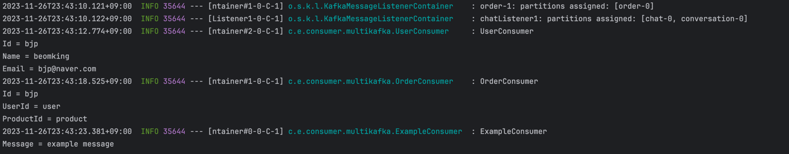

지금까지는 단일 컨슈머가 동작하는 것을 주로 살펴보았다.

그래서 스프링 카프카가 제공하는 `KafkaProperties`를 사용해서 컨슈머를 구성했다.

하지만 `KafkaProperties`는 단일 컨슈머를 구성하는 것에만 사용할 수 있으므로 여러 컨슈머를 구성하기 위해서는 별도의 설정 클래스를 만들어야 한다.

이번에는 별도의 설정 클래스를 만들어서 여러 컨슈머를 구성하는 방법을 알아보겠다.

> 관련 코드는 [consumer](https://github.com/BEOMKING/Study/tree/main/Kafka/consumer)에서 확인할 수 있다.

## Kafka Custom Properties

3개의 토픽을 구독하는 예제를 만들어보겠다.

```yaml
kafka:
  consumers:
    user:
      bootstrap-servers: localhost:9092
      topic: user
      group-id: user-1
      auto-offset-reset: earliest
    order:
      bootstrap-servers: localhost:9092
      topic: order
      group-id: order-1
      auto-offset-reset: earliest
    example:
      bootstrap-servers: localhost:9092
      topic: example
      group-id: example-1
      auto-offset-reset: latest
```

각 컨슈머에 대한 동적인 설정을 yaml 파일에 작성했다.

`ConfigurationProperties`를 사용해서 yaml 파일과 `KafkaProperties` 내에 있는 `KakfaProperties.Consumer`에 매핑할 수 있다.

따라서, 더 많은 옵션을 사용하고 싶다면 yaml 파일에 추가적으로 작성할 수 있다.

```java
@Getter
@Setter
@Configuration
@ConfigurationProperties(prefix = "kafka")
public class KafkaMultipleProperties {
    private List<String> bootstrapServers = new ArrayList<>(Collections.singletonList("localhost:9092"));
    private Map<String, KafkaProperties.Producer> producers;
    private Map<String, KafkaProperties.Consumer> consumers;
    private KafkaProperties.Ssl ssl = new KafkaProperties.Ssl();
    private KafkaProperties.Security security = new KafkaProperties.Security();

    public Map<String, Object> buildCommonProperties() {
        final Map<String, Object> properties = new HashMap<>();

        if (this.bootstrapServers != null) {
            properties.put(CommonClientConfigs.BOOTSTRAP_SERVERS_CONFIG, this.bootstrapServers);
        }

        properties.putAll(this.ssl.buildProperties());
        properties.putAll(this.security.buildProperties());

        return properties;
    }
}
```


## Kafka Multiple Consumer Configuration

위에서 구현한 `KafkaMultipleProperties`를 사용해서 여러 컨슈머를 구성해보겠다.

```java
@Slf4j
@Configuration
@RequiredArgsConstructor
public class KafkaMultipleConsumerConfig {
    private final KafkaMultipleProperties kafkaMultipleProperties;

    @Bean
    @Qualifier("userKafkaListenerContainerFactory")
    public KafkaListenerContainerFactory<ConcurrentMessageListenerContainer<String, User>> userKafkaListenerContainerFactory() {
        final ConcurrentKafkaListenerContainerFactory<String, User> factory = new ConcurrentKafkaListenerContainerFactory<>();
        factory.setConsumerFactory(new DefaultKafkaConsumerFactory<>(consumerConfig("user"), new StringDeserializer(), new JsonDeserializer<>(User.class)));
        factory.setCommonErrorHandler(customErrorHandler());
        return factory;
    }

    @Bean
    @Qualifier("orderKafkaListenerContainerFactory")
    public KafkaListenerContainerFactory<ConcurrentMessageListenerContainer<String, Order>> orderKafkaListenerContainerFactory() {
        final ConcurrentKafkaListenerContainerFactory<String, Order> factory = new ConcurrentKafkaListenerContainerFactory<>();
        factory.setConsumerFactory(new DefaultKafkaConsumerFactory<>(consumerConfig("order"), new StringDeserializer(), new JsonDeserializer<>(Order.class)));
        factory.setCommonErrorHandler(customErrorHandler());
        return factory;
    }

    @Bean
    @Qualifier("exampleKafkaListenerContainerFactory")
    public KafkaListenerContainerFactory<ConcurrentMessageListenerContainer<String, String>> exampleKafkaListenerContainerFactory() {
        final ConcurrentKafkaListenerContainerFactory<String, String> factory = new ConcurrentKafkaListenerContainerFactory<>();
        factory.setConsumerFactory(new DefaultKafkaConsumerFactory<>(consumerConfig("example")));
        return factory;
    }

    private Map<String, Object> consumerConfig(final String consumerName) {
        final Map<String, Object> properties = kafkaMultipleProperties.buildCommonProperties();

        if (nonNull(kafkaMultipleProperties.getConsumers())) {
            properties.putAll(kafkaMultipleProperties.getConsumers().get(consumerName).buildProperties());
        }

        log.info("Kafka Consumer '{}' Properties: {}", consumerName, properties);
        return properties;
    }

    private DefaultErrorHandler customErrorHandler() {
        return new DefaultErrorHandler((record, exception) ->
                log.error("[Error] topic = {}, key = {}, value = {}, error message = {}", record.topic(),
                        record.key(), record.value(), exception.getMessage())
        );
    }
}
```

각 `@Bean` 메서드에서 컨슈머명을 인자로 받아 컨슈머별로 `DefaultKafkaConsumerFactory`를 생성한다. 

`KafkaMultipleProperties`에서 `KafkaProperties.Consumer`를 사용하기 때문에 `buildProperties()`을 이용해 옵션을 설정할 수 있다.

> `DefaultErrorHandler`는 역직렬화 실패 시에 발생하는 예외를 처리하기 위해 사용했다.

## Kafka Multiple Consumer Listener

```java
@Slf4j
@Component
public class OrderConsumer {
    @KafkaListener(
            topics = "${kafka.consumers.order.topic}",
            groupId = "${kafka.consumers.order.group-id}",
            containerFactory = "orderKafkaListenerContainerFactory"
    )
    public void consume(final Order order) {
        log.info("OrderConsumer \nId = {}\nUserId = {}\nProductId = {}", order.getId(), order.getUserId(), order.getProductId());
    }
}
```
```java
@Slf4j
@Component
public class UserConsumer {
    @KafkaListener(
            topics = "${kafka.consumers.user.topic}",
            groupId = "${kafka.consumers.user.group-id}",
            containerFactory = "userKafkaListenerContainerFactory"
    )
    public void consume(final User user) {
        log.info("UserConsumer \nId = {}\nName = {}\nEmail = {}", user.getId(), user.getName(), user.getEmail());
    }
}
```

```java
@Slf4j
@Component
public class ExampleConsumer {
    @KafkaListener(
            topics = "${kafka.consumers.example.topic}",
            groupId = "${kafka.consumers.example.group-id}",
            containerFactory = "exampleKafkaListenerContainerFactory"
    )
    public void consume(final String message) {
        log.info("ExampleConsumer \nMessage = {}", message);
    }
}
```

각 컨슈머별로 `@KafkaListener`를 구현햇고 아래와 같이 역직렬화까지 잘 수행하는 것을 확인할 수 있다.



## 마무리

이번 포스팅에서는 여러 컨슈머를 구성하는 방법에 대해서 알아보았다.

여러 토픽을 단일 애플리케이션에서 구독하는 경우에는 도움이 될 수 있을 것 같다.
