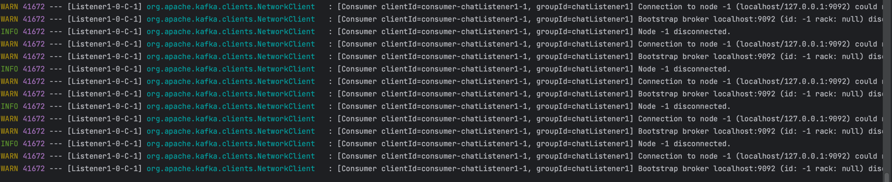

## 문제 상황

내가 컨슈머를 구현하는 프로젝트가 항상 컨슈머를 사용하는 프로젝트가 아니라고 가정해보자.

가령, 특정 고객사가 컨슈머를 사용하는 제품을 구매하지 않았다면 컨슈머를 사용하지 않는 경우가 이런 케이스이다.

물론 이런 경우는 프로젝트를 분리하는 것이 좋겠지만 프로젝트를 분리하지 않고 하나의 프로젝트에서 컨슈머를 조건부로 사용하고 싶다면 어떻게 해야할까?

첫 번째 방법은 스프링 컨슈머 빈을 조건부로 등록하는 것이고 두 번째 방법은 리스너만 조건부로 등록하는 것이다. 

그냥 등록해두고 가만 냅두면 되는 것이 아니냐라고 생각할 수 있지만, 아래와 같은 로그 메시지가 게속 발생하기도 하고 불필요한 리소스 사용을 막기 위해서라도 조건부로 등록하는 것이 좋다.

예를 들어 이런 메시지..



### 스프링 컨슈머 빈을 조건부로 등록하기
```java
@EnableKafka
@EnableConfigurationProperties(KafkaProperties.class)
@Configuration
@ConditionalOnProperty(name = "spring.kafka.consumer.enabled", havingValue = "true")
public class KafkaConsumerConfig {
    private final KafkaProperties kafkaProperties;

    public KafkaConsumerConfig(final KafkaProperties kafkaProperties) {
        this.kafkaProperties = kafkaProperties;
    }

    @Bean
    public KafkaListenerContainerFactory<ConcurrentMessageListenerContainer<String, Chat>> kafkaListenerContainerFactory() {
        final ConcurrentKafkaListenerContainerFactory<String, Chat> factory = new ConcurrentKafkaListenerContainerFactory<>();
        factory.setConsumerFactory(consumerFactory());
        factory.setBatchListener(true);
        factory.getContainerProperties().setAckMode(ContainerProperties.AckMode.MANUAL);

        return factory;
    }
    // 생략
}
```

위와 같은 컨슈머 구성을 등록할 때, `@ConditionalOnProperty` 어노테이션을 사용하면 된다.

`@ConditionalOnProperty` 어노테이션은 `name`과 `havingValue`를 사용해서 조건을 설정할 수 있다.

다만, `@ConditionalOnProperty` 어노테이션을 사용하면 `KafkaAutoConfiguration`이 자동으로 등록되기 때문에 `KafkaAutoConfiguration`을 제외해줘야 한다.

```java
@SpringBootApplication(exclude = KafkaAutoConfiguration.class)
public class ConsumerApplication {
    public static void main(String[] args) {
        SpringApplication.run(ConsumerApplication.class, args);
    }
}
```

이 방법은 필요에 의해(예를 들어, 테스트 코드에서 Producer를 쉽게 사용해야 하거나) `KafkaAutoConfiguration`을 사용해야 하는 경우 사용할 수 없다는 단점이 있다.

### 리스너만 조건부로 등록하기

```java
@KafkaListener(topics = "#{'${spring.kafka.topics.chat}'.split(',')}", containerFactory = "kafkaListenerContainerFactory", autoStartup = "${spring.kafka.consumer.enabled}")
public void recordChat(final List<Chat> chat, final Acknowledgment ack) {
    log.info("Consumed size : {}", chat.size());
    chat.forEach(chatRepository::save);
    ack.acknowledge();
}
```

`@KafkaListener` 어노테이션에 `autoStartup` 속성을 사용해서 조건부로 리스너를 등록할 수 있다. 

이 방법은 `KafkaAutoConfiguration`을 사용할 수 있기 때문에 `KafkaAutoConfiguration`을 제외할 필요가 없다.

## 마치며

이번 글에서는 스프링에서 컨슈머를 조건부로 사용하는 방법에 대해서 알아봤다.

물론 프로젝트를 분리해 이런 케이스 자체가 없게 하는 것처럼 더 좋은 방법이 있겠지만, 프로젝트를 분리하지 않고 하나의 프로젝트에서 컨슈머를 조건부로 사용하고 싶다면 위와 같은 방법을 사용하면 될 것 같다.