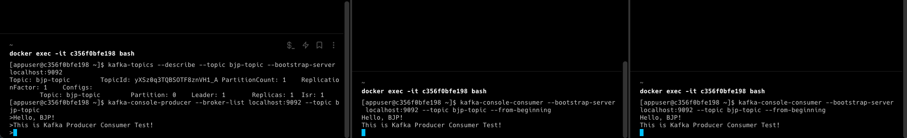

## 실습용 Kafka docker-compose 세팅
```bash
$ docker-compose version
Docker Compose version v2.20.3
```

docker-compose의 버전이 2.0 이상이어야 한다.

```yaml
version: '1'
services:
  zookeeper:
    container_name: local-zookeeper
    image: zookeeper:3.8.2
    environment:
      ZOOKEEPER_SERVER_ID: 1
      ZOOKEEPER_CLIENT_PORT: 2181
      ZOOKEEPER_TICK_TIME: 2000
      ZOOKEEPER_INIT_LIMIT: 5
      ZOOKEEPER_SYNC_LIMIT: 2
    ports:
      - "2181:2181"
  kafka:
    container_name: local-kafka
    image: confluentinc/cp-kafka:latest
    depends_on:
      - zookeeper
    ports:
      - "9092:9092"
    environment:
      KAFKA_BROKER_ID: 1
      KAFKA_ZOOKEEPER_CONNECT: 'zookeeper:2181'
      KAFKA_ADVERTISED_LISTENERS: PLAINTEXT://kafka:9092,PLAINTEXT_HOST://localhost:29092
      KAFKA_LISTENER_SECURITY_PROTOCOL_MAP: PLAINTEXT:PLAINTEXT,PLAINTEXT_HOST:PLAINTEXT
      KAFKA_INTER_BROKER_LISTENER_NAME: PLAINTEXT
      KAFKA_OFFSETS_TOPIC_REPLICATION_FACTOR: 1
      KAFKA_GROUP_INITIAL_REBALANCE_DELAY_MS: 0
```

docker-compose.yml 파일을 작성한다.

docker-compose를 수행하기 위해서는 해당 파일이 위치한 디렉토리에서 아래 명령어를 수행한다.

```bash
$ docker-compose -f {docker-compose file name} up -d
```

`-f` 옵션을 통해 docker-compose 파일을 지정할 수 있다.

`-d` 옵션을 통해 백그라운드에서 실행할 수 있다.

그리고 다음과 같은 명령어를 수행하자. 아래 명령어는 생성한 컨테이너 내부에 접속하는 명령어이다.

다음 단락에서 Kafka 명령어를 통해 토픽을 생성하고 통신을 테스트하기 위해 필요한 명령어이다.

```bash
$ docker exec -it {컨테이너명 or 컨테이너 ID} bash
```

## Kafka 명령어
### Topic
- `kafka-topics`: 토픽 관리 명령어
- `--bootstrap-server {kafka-address}`: 카프카 서버 주소
- `{ip:port}`: 카프카 서버 주소:포트

#### Topic 생성
```bash
$ kafka-topics --create --topic {topic-name} --bootstrap-server {ip:port} --replication-factor 1 --partitions 1
```
- `--create`: 토픽 생성
- `--topic {topic-name}`: 토픽 이름
- `--replication-factor`: 복제본 수
- `--partitions`: 파티션 수

#### Topic 목록 조회
```bash
$ kafka-topics --bootstrap-server {ip:port} --list
```

#### Topic 상세 조회
```bash
$ kafka-topics --describe --topic {topic-name} --bootstrap-server {ip:port}
```

### Producer Consumer Test

카프카는 간단한 콘솔 테스트를 지원한다.

#### Producer

```bash
$ kafka-console-producer --broker-list {ip:port} --topic {topic-name}
```

#### Consumer

```bash
$ kafka-console-consumer --bootstrap-server {ip:port} --topic {topic-name} --from-beginning
```
아래는 간단하게 하나의 Producer에서 2개의 Consumer에 메시지를 전송하는 예제이다.

