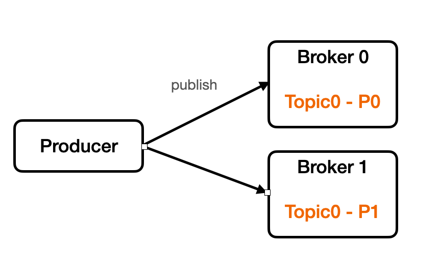

# Kafka
카프카란 오픈소스 분산 이벤트 스트리밍 플랫폼이다. 비동기 메시징을 처리하는 메시지 큐로 많이 사용된다.

발행/구독 모델(pub/sub)의 방식을 사용한다. 즉, 데이터를 전송하는 방식이 아닌 받기를 원하는 주체가 토픽(topic)을 구독함으로써 데이터를 읽어오는 방식이다.

## 구조

- Broker
  카프카 클러스터는 여러 개의 브로커로 이루어져 있다. 이 브로커들이 각각의 서버라고 볼 수 있다. 이 브로커들이 메시지를 나눠서 저장, 이중화, 장애 발생시 대체 등을 수행한다.

- Zookeeper

  카프카 클러스터를 관리하는 역할을 한다. 카프카 클러스터와 관련된 정보가 기록이 되고 관리가 된다.

- Producer
  
  카프카 클러스터에 메시지를 발행(produce)하는 역할을 한다.
  
- Consumer

  카프카 클러스터에서 메시지를 읽는(consume) 역할을 한다.

## Topic & Partition

토픽은 메세지를 저장하는 단위를 의미한다. 

여러 가지 메시지가 있을 때 이 메시지들을 구분하기 위한 용도로 사용된다.

토픽은 한 개 이상의 파티션으로 구성된다. 즉, 파티션은 메시지를 저장하는 물리적인 파일을 의미한다.

- 파티션은 추가만 가능한(append only) 파일
- 각 메시지 저장 위치를 오프셋(offset)이라고 한다.
- 프로듀서가 넣은 메시지는 큐와 같이 파티션의 맨 뒤에 추가된다.
- 컨슈머는 오프셋 기준으로 메시지를 순서대로 읽는다.
- 메시지는 읽어진다고 삭제되지 않으며 설정에 따라 일정 시간이 지난 뒤에 삭제된다.

## Producer

카프카 클러스터에 메시지를 발행(produce)하는 역할을 한다.

라운드 로빈(round-robin) 또는 키를 이용해 저장할 파티션을 선택해서 저장한다.

키 방식의 경우, 프로듀서가 카프카에 메시지를 전송할 때 토픽뿐만 아니라 키를 지정할 수 있다. 이 때, 키의 해시값을 이용해 저장할 토픽을 선택한다. 같은 키에 대해서는 메시지 순서가 유지된다.

## Consumer

카프카 클러스터에서 메시지를 읽는(consume) 역할을 한다.

컨슈머는 컨슈머 그룹에 속하며 한 개 파티션은 컨슈머 그룹의 한 개 컨슈머에만 연결 가능하다.

즉, 컨슈머 그룹에 속한 컨슈머는 파티션을 공유할 수 없으며 하나의 컨슈머 그룹 내에서는 파티션의 메시지가 순차적으로 처리됨을 보장한다.

위 그림처럼 컨슈머 0에서 이미 연결했기 때문에 컨슈머 1은 파티션 0과 연결할 수 없다. 컨슈머 2는 파티션 2, 3과 연결된 것처럼 하나의 컨슈머가 여러 파티션과 연결할 수 있다.

## 성능

- 파티션 파일은 OS 페이지캐시 사용

  - 파티션에 대한 파일 IO를 메모리에서 처리
  - 서버에서 페이지 캐시를 카프카만 사용해야 성능에 유리

- Zero Copy

  - 디스크 버퍼에서 네트워크 버퍼로 직접 데이터 복사

- 컨슈머 추적을 위해 브로커가 하는 일이 비교적 단순

  - 메시지 필터, 메시지 재전송과 같은 일은 브로커가 하지 않음
    - 프로듀서, 컨슈머가 직접 해야 함
  - 브로커는 컨슈머와 파티션 간 매핑 관리

- 묶어서 보내기, 묶어서 받기 (**batch**)

  - 프로듀서: 일정 크기만큼 메시지를 모아서 전송 가능
  - 컨슈머: 최소 크기만큼 메시지를 모아서 조회 가능

  낱개 처리보다 처리량 증가

## 카프카와 성능

- 스케일-아웃에 용이한 구조를 가지고 있어서 처리량 증대(확장)가 쉬움
  - 1개 장비의 용량 한계 -> 브로커 추가, 파티션 추가
  - 컨슈머가 느림 -> 컨슈머 추가 (+파티션 추가)

## 리플리카 - 복제

- 리플리카: 파티션의 복제본
  - 복제수(**replication factor**) 만큼 파티션의 복제본이 각 브로커에 생김
- 리더와 팔로워 구성
  - 프로듀서와 컨슈머는 리더를 통해서만 메시지 처리
  - 팔로워는 리더로부터 복제
- 장애 대응
  - 리더가 속한 브로커 장애시 다른 팔로워가 리더가 됨
  - 프로듀서와 컨슈머는 새로운 리더를 통해서 메시지를 다시 처리할 수 있게 됨

## Reference

[kafka 조금 아는 척하기 시리즈](https://www.youtube.com/watch?v=0Ssx7jJJADI&list=PLwouWTPuIjUgr29uSrSkVo8PRmem6HRDE&index=3)

