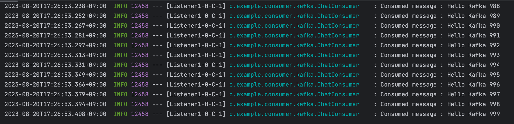
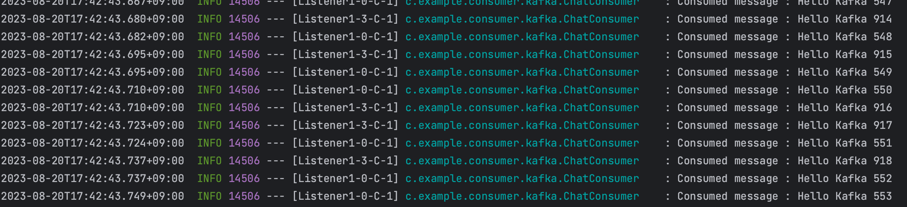
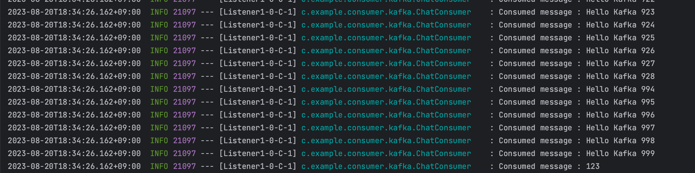

# Consumer
Spring Boot 3.1.2, Spring Kafka 3.4.1 버전을 기준으로 진행한다.

관련 코드는 [consumer](https://github.com/BEOMKING/Study/tree/main/Kafka/consumer)에서 확인할 수 있다.

## 내부 동작 방식

**1. 토픽 구독**

**2. 카프카 서버 조사(폴 루프) : 서버 조정, 파티션 리벨런스, 컨슈머 하트비트 체크 등**

**3. 새로운 레코드가 있는 지 체크하고 있으면 가져옴**

**4. 역직렬화**

**5. 데이터 유효성 검증**

**6. 다른 시스템에 이관 및 저장** 

컨슈머의 역할은 다음과 같다.

- 토픽 구독

  컨슈머 동작의 시작은 토픽의 구독이다.

- 오프셋 위치

  카프카는 다른 큐와는 다르게 메시지 오프셋을 저장하지 않는다.

  오프셋은 각자의 컨슈머들이 설정을 이용해서 유지해야한다.

- 재연/되감기/메시지 스킵

  컨슈머의 지정된 파티션의 멤버쉽과 소유권을 확인하기 위해 하트비트를 이용하여 주기적으로 체크한다.

  하트비트를 수신하지 못하면 컨슈머 그룹의 컨슈머 재할당(**리벨런싱**)이 일어난다. 

- 오프셋 커밋

  리벨런싱이 일어날 때 이미 읽은 오프셋을 다시 읽을 수 있으므로 오프셋 커밋을 한다.

- 역직렬화

  프로듀서에서는 카프카에 메시지를 보낼 때 어떤 직렬화를 했는지 명시하고 컨슈머에서는 역직렬화를 명시한다.

## 설정

- **bootstrap.servers** 

  브로커 주소 목록 hostname:port 형식, 프로듀서 설정과 동일

- **key.deserializer**, **value.deserializer**

  프로듀서에서 key.serializer와 동일한 클래스로 deserializer 한다.

  다른 클래스로 deserializer 하면 예외 발생

  ByteArraySerializer, StringSerializer, IntegerSerializer 중에 하나 선택

- **group.id**

  컨슈머 그룹 정의이전 버전에서는 필수가 아니었지만 최근 버전에서는 필수로 변경되었다.

  사용하지 않으면 아래와 같은 에러 발생(Attempt to join group failed due to fatal error: The configured groupId is invalid)

- `enable.auto.commit`

  - true

    자동 커밋 (컨슈머의 기본 설정값)

    auto.commit.interval.ms=1000 이 값을 길게 잡으면 장애 발생시 중복 읽기가 발생할 수 있음

    예) 커밋 주기가 10초인데 7초가 지난 후 컨슈머 장애가 발생하면 이전 10초 전에 커밋한 오프셋을 가져오므로 중복 발생

  - false

    현재 오프셋 커밋

    상황에 따라 필요할 때 커밋 제어시 사용

    commitSync() 메서드를 사용해 커밋할 컨슈머 오프셋을 호출한다.

    ConsumerRecord의 인스턴스를 처리 후 사용 권장하며 그렇게 안하면 컨슈머 장애기 발생할 경우 레코드 손실 발생

  - 비동기

    비동기 커밋

    동기 방식의 커밋은 Ack 수신이 없는 경우, 컨슈머는 대기 상태가 되므로 결과적으로 처리 속도가 좋지 못하다.

    비동기도 메시지 중복은 발생할 수 있다.

    예) 메시지 오프셋 10을 오프셋 5 이전에 커밋 했다면, 카프카는 5부터 10까지 다시 읽으므로 중복 발생

- `fetch.min.bytes`

  데이터 읽기 요청에 대한 카프카 서버의 회신을 요구하는 데이터 바이트의 최소 크기

- `request.timeout.ms`

  응답을 기다리는 최대 시간

- `auto.offset.reset`

  컨슈머는 파티션의 오프셋을 기준으로 메시지를 구독한다. 하지만 컨슈머가 처음 컨슈머 그룹을 구성하여 구동되거나, 컨슈머가 다소 오랜 기간동안 중단되었다가 구동되어 오프셋에 대응되는 메시지가 브로커에서 삭제된 경우 즉, **컨슈머가 오프셋 정보를 가지고 있지 않은 경우에는 해당 정보를 초기화해야 한다. 

  초기화는 다음 3가지 방식을 사용할 수 있으며 기본값은 `lastest`이다.

  - lastest 

    파티션에서 가장 최근 메시지부터 시작

  - earliest

    파티션 맨 처음부터 시작

  - none

    예외가 발생됨

- `session.timeout.ms`

  "컨슈머 동작 중이다"라고 알리기 위한 하트비트 전송 주기

  리밸런서 트리거 하는걸 막기 위함

- `max.partition.fetch.bytes`

  파티션마다 할당할 최대 데이터 크기

  ConsumerRecord 객체에 대해 컨슈머가 필요로 하는 메모리는 파티션수 * 설정값보다 커야함

  예) 파티션 10개 1개의 컨슈머이고, max.partiton.fetch.bytes가 2MB면 10 * 2MB = 20MB가 메모리로 잡혀 있어야한다.

## Consumer 구현

`Message Listeners`, `@KafkaListener` 두 가지 방식으로 구현 가능하다.

프로듀서와 마찬가지로 Config 구성이 필요하고 클래스와 설정 파일(yaml or properties)에 작성하는 두 가지 방식을 사용할 수 있고 코드로 작성하는 방식을 사용하겠다.

### @KafkaListener

`@KafkaListener`를 사용하기 위해서는 `Consumer Configuration`, `@EnableKafka`가 필요하다.

#### Consumer Configuration

```java
@EnableKafka
@Configuration
public class KafkaConsumerConfig {
    @Bean
    public ConsumerFactory<String, Chat> consumerFactory() {
        return new DefaultKafkaConsumerFactory<>(producerConfigs(), new StringDeserializer(), new JsonDeserializer<>(Chat.class));
    }

    @Bean
    public Map<String, Object> producerConfigs() {
        return Map.of(
                ConsumerConfig.BOOTSTRAP_SERVERS_CONFIG, "localhost:9092",
                ConsumerConfig.GROUP_ID_CONFIG, "chatGroupId"
        );
    }

    @Bean
    public ConcurrentKafkaListenerContainerFactory<String, Chat> kafkaListenerContainerFactory() {
        final ConcurrentKafkaListenerContainerFactory<String, Chat> factory = new ConcurrentKafkaListenerContainerFactory<>();
        factory.setConsumerFactory(consumerFactory());

        return factory;
    }
}
```

##### 역직렬화

Key, Value를 역직렬화 하는 설정이 필요하다.

메시지를 받아서 직접 변환하는 것보다는 자동으로 변환시켜주는 것이 더 편하기 때문이다. 그래서 관련 Factory 클래스들의 타입을 <String, Chat>으로 지정하였다.

`KafkaConsumerFactory`에 직렬화 설정을 넣어야 하는데 메시지를 객체로 역직렬화하기 위해서는 `JsonDeserializer`를 등록해야 한다.

> 주의할 점이 있는데 `com.fasterxml.jackson.databind.JsonDeserializer`이 아니라 `org.springframework.kafka.support.serializer.JsonDeserializer`이다.

##### 동시성

`ConcurrentKafkaListenerContainerFactory`는 `concurrency` 옵션을 설정할 수 있다.

이 값에 따라 `KafkaMessageListenerContainer`를 개별적으로 생성하여 멀티 스레드를 지원한다.

#### @KafkaListener 사용

이렇게 등록한 리스너는 다음과 같이 사용할 수 있다.

```java
@Slf4j
@Service
public class ChatConsumer {
    private final ChatRepository chatRepository;

    public ChatConsumer(final ChatRepository chatRepository) {
        this.chatRepository = chatRepository;
    }

    @KafkaListener(id = "chatListener1", topics = "#{'${spring.kafka.topics.chat}'.split(',')}", containerFactory = "kafkaListenerContainerFactory", autoStartup = "${spring.kafka.consumer.enabled}")
    public void recordChat(final List<Chat> chat, final Acknowledgment ack) {
        log.info("Consumed size : {}", chat.size());
        chat.forEach(chatRepository::save);
        ack.acknowledge();
    }
}
```

`@KafkaListener` 애노테이션은 어떻게 동작되는 것일까?

`@KafkaListener` 애노테이션은 스프링 컨테이너 내에서 빈으로 등록되지 않는다. 대신, `KafkaListnerEndpointRegistry`에 빈으로 등록된다.

```java
public class KafkaListenerEndpointRegistry implements ListenerContainerRegistry, DisposableBean, SmartLifecycle,
		ApplicationContextAware, ApplicationListener<ContextRefreshedEvent> {
    // 생략
    public void registerListenerContainer(KafkaListenerEndpoint endpoint, KafkaListenerContainerFactory<?> factory,
                                          boolean startImmediately) {

      Assert.notNull(endpoint, "Endpoint must not be null");
      Assert.notNull(factory, "Factory must not be null");

      String id = endpoint.getId();
      Assert.hasText(id, "Endpoint id must not be empty");
      synchronized (this.listenerContainers) {
        Assert.state(!this.listenerContainers.containsKey(id),
                "Another endpoint is already registered with id '" + id + "'");
        MessageListenerContainer container = createListenerContainer(endpoint, factory);
        this.listenerContainers.put(id, container); // 요기서 빈으로 등록
        ConfigurableApplicationContext appContext = this.applicationContext;
        String groupName = endpoint.getGroup();
        if (StringUtils.hasText(groupName) && appContext != null) {
          List<MessageListenerContainer> containerGroup;
          ContainerGroup group;
          if (appContext.containsBean(groupName)) { // NOSONAR - hasText
            containerGroup = appContext.getBean(groupName, List.class); // NOSONAR - hasText
            group = appContext.getBean(groupName + ".group", ContainerGroup.class);
          }
          else {
            containerGroup = new ArrayList<MessageListenerContainer>();
            appContext.getBeanFactory().registerSingleton(groupName, containerGroup); // NOSONAR - hasText
            group = new ContainerGroup(groupName);
            appContext.getBeanFactory().registerSingleton(groupName + ".group", group);
          }
          containerGroup.add(container);
          group.addContainers(container);
        }
        if (startImmediately) {
          startIfNecessary(container);
        }
      }
    }
    // 생략
}
```

### Single Thread

1000개 메시지를 수신하는 것을 구현해보겠다. 다만 성능에 대한 부분을 와닿게 표현하기 위해 0.01초의 지연 시간을 추가했다.

```java
@Slf4j
@Service
public class ChatConsumer {
    private final ChatRepository chatRepository;

    public ChatConsumer(final ChatRepository chatRepository) {
        this.chatRepository = chatRepository;
    }

    @KafkaListener(id = "chatListener1", topics = "chat")
    public void recordChat(final Chat chat) {
        try {
            Thread.sleep(10);
            log.info("Consumed message : {}", chat.getContent());
            chatRepository.save(chat);
        } catch (InterruptedException e) {
            e.printStackTrace();
        }
    }
}
```



단일 스레드로(위 그림의 `Listener1-0-C-1`)로 동작하기 때문에 1000개의 메시지를 수신하는 성능이 나쁜 것을 확인할 수 있다. (12.444s 소요)

### Multi Thread

파티션 개수는 그대로 둔채 컨슈머를 늘리는 것은 의미가 없다. 파티션 개수를 늘려보자.

```bash
kafka-topics --alter --topic chat --partitions 5 --bootstrap-server localhost:9092
```

위 KafkaConsumerConfig 클래스에 Concurrency 옵션을 추가하자.

``` java
@Bean
public ConcurrentKafkaListenerContainerFactory<String, Chat> kafkaListenerContainerFactory() {
    final ConcurrentKafkaListenerContainerFactory<String, Chat> factory = new ConcurrentKafkaListenerContainerFactory<>();
    factory.setConsumerFactory(consumerFactory());
    factory.setConcurrency(5);

    return factory;
}
```



위 사진에는 2개 밖에 없지만 총 5개의 컨슈머로 동작하며 더 빠른 속도로 메시지를 수신하게 되었다. 다만, 수신하는 메시지의 순서를 보장받지는 못한다. (8.372s 소요)

### Batch Listener

KafkaConsumerConfig 클래스에 Batch 옵션과 메시지 개수 옵션을 지정해주자.

```java
@Bean
public Map<String, Object> producerConfigs() {
    return Map.of(
            ConsumerConfig.BOOTSTRAP_SERVERS_CONFIG, "localhost:9092",
            ConsumerConfig.GROUP_ID_CONFIG, "chatGroupId",
            ConsumerConfig.MAX_POLL_RECORDS_CONFIG, 200
    );
}

@Bean
public KafkaListenerContainerFactory<ConcurrentMessageListenerContainer<String, Chat>> kafkaListenerContainerFactory() {
    final ConcurrentKafkaListenerContainerFactory<String, Chat> factory = new ConcurrentKafkaListenerContainerFactory<>();
    factory.setConsumerFactory(consumerFactory());
    factory.setBatchListener(true);

    return factory;
}
```

컨슘 로직도 약간 변경이 필요하다.

```java
@KafkaListener(id = "chatListener1", topics = "chat")
public void recordChat(final List<Chat> chat) {
    try {
        Thread.sleep(10);
    } catch (InterruptedException e) {
        e.printStackTrace();
    }

    chat.forEach(c -> log.info("Consumed message : {}", c.getContent()));
    log.info("Consumed message : {}", chat.size());
}
```



메시지가 어느정도 쌓인 다음 수신하기 때문에 빠른 처리량을 보여준다. (0.231s 소요)

## 고려해야할 점

- 예외처리

- 리벨런스 관리

  새로운 컨슈머가 컨슈머 그룹에 합류할 때마다, 혹은 예전 컨슈머가 종료되면 파티션 리밸런스가 트리거 된다. 

  (컨슈머 그룹의 컨슈머 개수와 파티션이 같을 때 새로운 컨슈머 추가는 리밸런스가 안일어남)

  컨슈머가 파티션 소유권을 잃을 때마다 가장 최근에 수신한 오프셋을 반드시 커밋해 줘야 한다. 

- 제때 오프셋 커밋하기

  메시지 오프셋에 대한 커밋은 처리 상황에 따라 잘 제때 수행해야 한다. 

  그렇지 않으면 중복 및 소실이 발생할 수 있다. 

- 오프셋 주기에 따른 성능과 중복에 대한 문제간의 트레이드 오프가 필요한다.

  예) 장애 발생시 데이터 중복 처리에 대한 심각한 문제가 발생할 경우 오프셋을 커밋하는 시간을 가능한 짧게 한다. 

- 자동 오프셋 커밋

  **중복 처리에 대한 문제가 없거나, 컨슈머가 자동으로 오프셋을 커밋하도록 관리하기를 바랄경우 사용한다.** 

  일반적으로 대부분 사용