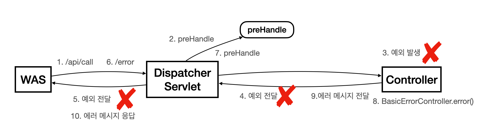
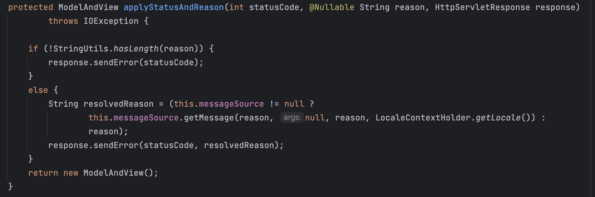
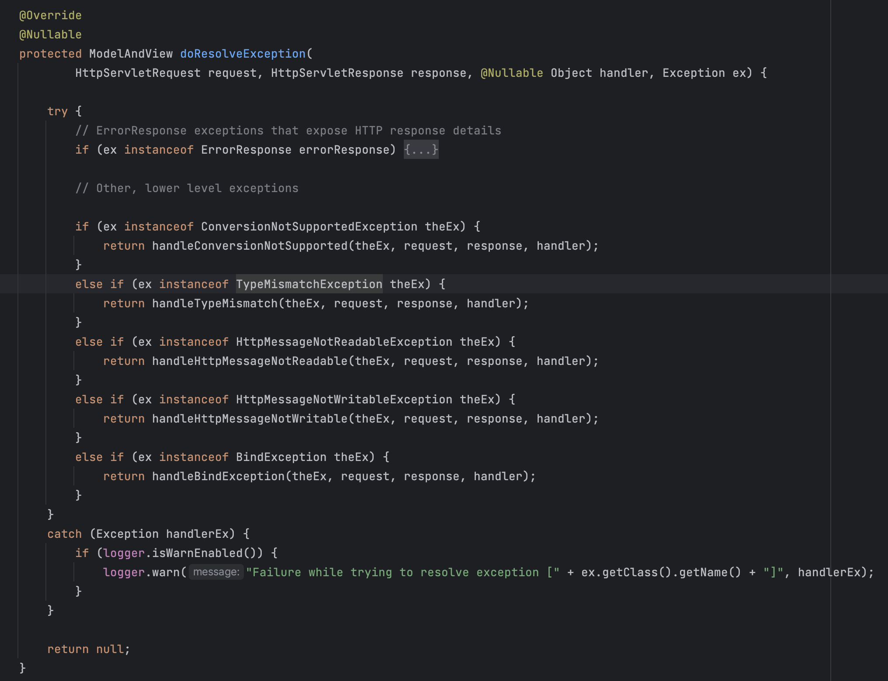
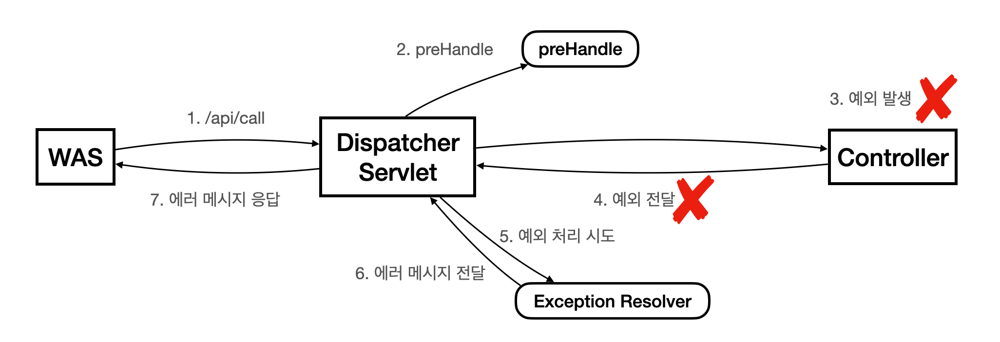

# ExceptionHandler

API 통신을 사용할 때는 다양한 오류 상황에 맞는 스펙으로 응답을 내려주어야 한다. 또한, 에러 응답은 일관적이어야 한다. 매 요청마다 일관적이지 못한 응답 스펙이 오면 클라이언트 입장에서 에러 응답을 처리하기가 어렵기 때문이다.

스프링에서 이를 편리하게 처리할 수 있도록 제공하는 것이 `@ExceptionHandler`이다.

`@ExceptionHandler`를 이용한 공통 예외 처리 구현은 다음과 같다.

```java
@Slf4j
@RestControllerAdvice
public class ExControllerAdvice {
    @ExceptionHandler(IllegalStateException.class)
    public ResponseEntity<ErrorResponse> handleIllegalStateException(final RuntimeException e) {
        log.error("IllegalStateException", e);
        return ResponseEntity.badRequest().body(new ErrorResponse(e.getMessage(), HttpStatus.BAD_REQUEST.value()));
    }

    @ExceptionHandler
    @ResponseStatus(HttpStatus.BAD_REQUEST)
    public ErrorResponse handleUserException(final UserException e) {
        log.error("UserException", e);
        return new ErrorResponse(e.getMessage(), HttpStatus.BAD_REQUEST.value());
    }

    @ExceptionHandler
    public ResponseEntity<ErrorResponse> internalServerError(final Exception e) {
        log.error("InternalServerError", e);
        final ErrorResponse response = new ErrorResponse("서버 오류", HttpStatus.INTERNAL_SERVER_ERROR.value());
        return ResponseEntity.status(HttpStatus.INTERNAL_SERVER_ERROR).body(response);
    }
}
```

```java
// 커스텀 응답 DTO
@Getter
public class ErrorResponse {
    private String message;
    private Integer status;

    public ErrorResponse(final String message, final Integer status) {
        this.message = message;
        this.status = status;
    }
}k
```

### @ExceptionHandler

@ExceptionHandler 애노테이션을 메서드 위에 선언하고 처리하고자 하는 예외를 명시하면 해당 예외가 발생했을 때 이 메서드를 호출한다.

처리하고자하는 예외를 무조건 등록할 필요는 없다. 등록하지 않으면 메서드 시그니처에 명시된 예외를 기본값으로 수행한다.

예를 들어, 위 예제의 handleUserException 메서드는 UserException 예외가 발생하면 호출된다.

> 상속 관계에 따른 우선순위가 존재한다.
> ```java
> @ExceptionHandler(부모예외.class)
> public String 부모예외처리()(부모예외 e) {
> // ..생략
> }
> 
> @ExceptionHandler(자식예외.class) 
> public String 자식예외처리()(자식예외 e) { 
> // ..생략
> }
> ```
>
> 이런 케이스에서 자식 예외가 호출되었을 때, 부모 메서드를 호출하지 않고 자식 메서드를 호출한다.
> 만약 자식 예외가 따로 정의되지 않았다면 부모 메서드를 호출한다.
>
> 꼭 ExceptionHandler가 아니더라도 스프링은 항상 자세한 것이 우선 순위를 가진다.

### @ResponseStatus

별다른 응답 메시지 설정 없이 그냥 예외 응답을 보내면 어떻게 될까?

위 ErrorResponse 객체는 사용자가 임의로 만든 객체이기 때문에 이 응답이 오류인지 정상인지 알 수가 없다. 따라서 200 OK 응답이 내려가게 된다.

하지만 오류라면 명시된 에러 상태 코드를 반환해야 한다. 이를 명시적으로 지정해주는 것이 `@ResponseStatus`이다.

이 애노테이션에 상태코드를 명시하여 오류 상태 코드도 메시지에 함께 넣어 줄 수 있다.

>  위 예제에서는 ResponseEntity 객체를 이용해 직접 상태코드를 넣어주는 방법도 병행해서 사용했다.

### @ControllerAdvice

모든 컨트롤러마다 `@ExceptionHandler`를 구현하는 것은 비효율적이다. 이를 개선한 방식이 `@ControllerAdvice`이다.

`@ControllerAdvice`는 대상으로 지정한 컨트롤러에 `@ExceptionHandler`, `@InitBinder`를 부여해주는 역할을 한다.

대상을 지정하지 않으면 모든 컨트롤러에 전역적으로 예외 처리를 적용할 수 있다.

> 여러 가지 옵션을 줄 수 있다.
>
> ```java
> @RestControllerAdvice(basePackages = {"com.example.mvc2.web.api", "com.example.mvc2.web.front"})
> @RestControllerAdvice(assignableTypes = {ApiExceptionController.class, FrontExceptionController.class})
> ```
>
> 특정 패키지 하위의 컨트롤러를 대상으로 할 수도 있고, 특정 컨트롤러를 대상으로 적용할 수 있는 옵션을 제공한다.

> 와 `@ControllerAdvice`의 차이는 @ResponseBody의 유무이다.
>
> JSON 형식으로 응답을 주려면 `@RestControllerAdvice`을 사용한다.

## 동작 원리 (HandlerExceptionResolver)

> 설명에 사용할 그림에는 많은 중간 과정이 생략되어 있습니다.

어떻게 특정 컨트롤러에서 예외가 발생했을 때 이를 찾아 JSON 객체를 응답해주는 것일까? 이것을 알아보기 전에 기본 에러 응답에 대해 먼저 알아보자.

우리는 이런 에러 응답을 많이 받아본 적이 있다.

```json
{
    "timestamp": "2023-07-02T11:56:39.656+00:00",
    "status": 500,
    "error": "Internal Server Error",
    "path": "/api2/members/bad"
}
```

하지만 이 응답은 우리가 따로 만들어준 적이 없다. 이 응답은 다음과 같은 과정을 통해 생성된다.



처음 API 콜을 통해 컨트롤러에 전달이되고 해당 컨트롤러의 로직이 수행되다 예외가 발생한다. 이후 WAS에 예외가 전달되면 WAS에서 `/error`로 다시 호출한다.

`/error`를 경로로 가지고 있는 `BasicErrorController`에서 `error()` 메서드를 호출해 응답 메시지를 생성하고 이를 WAS 전달하고 마무리 된다.

> `BasicErrorController.error()` 참고용
>
> ```java
> @Controller
> @RequestMapping("${server.error.path:${error.path:/error}}")
> public class BasicErrorController extends AbstractErrorController {
>   // ..생략
> 	@RequestMapping
> 	public ResponseEntity<Map<String, Object>> error(HttpServletRequest request) {
> 		HttpStatus status = getStatus(request);
> 		if (status == HttpStatus.NO_CONTENT) {
> 			return new ResponseEntity<>(status);
> 		}
> 		Map<String, Object> body = getErrorAttributes(request, getErrorAttributeOptions(request, MediaType.ALL));
> 		return new ResponseEntity<>(body, status);
> 	}
>   // ..생략
> }
> ```
>
> 

모든 예외가 발생할 때마다 `/error`를 호출하고 상태 코드 500을 사용하는 것은 복잡하다.

이를 해결하기 위해 스프링은 컨트롤러 밖으로 예외가 던져진 경우 예외를 해결하고, 동작을 새로 정의할 수 있는 방법인 `HandlerExceptionResolver` 을 제공한다.

스프링에서 제공하는 `HandlerExceptionResolver`는 다음과 같다. `HandlerExceptionResolverComposite`에 순서대로 등록하며 순서대로 우선 순위가 적용된다. 

1. `ExceptionHandlerExceptionResolver`
2. `ResponseStatusExceptionResolver`
3. `DefaultHandlerExceptionResolver` 우선 순위가 가장 낮다.

쉬운 순서대로 알아보자.

### ResponseStatusExceptionResolver

`ResponseStatusExceptionResolver`는 예외에 따라서 HTTP 상태 코드를 지정해 주는 역할을 한다.

`@ResponseStatus`가 붙어있거나 `ResponseStatusException`을 찾아 처리한다.

> `ResponseStatusException`은 주로 개발자가 변경할 수 없는 빌트인 or 라이브러리 예외를 변경하기 위해 사용한다.



`response.sendError()`를 호출하는데 이 메서드를 수행하면 WAS에서 다시 오류 처리 요청(`/error`)을 보낸다. 

### DefaultHandlerExceptionResolver

`DefaultHandlerExceptionResolver`은 스프링 내부에서 발생하는 스프링 예외를 해결한다.

우리가 `Integer`필드에 문자열을 넣어서 요청을 하면 500이 아닌 400 응답이 온다. 이 과정이 `DefaultHandlerExceptionResolver`의 로직이 수행된 결과이다.



필드 타입 예외로 TypeMismatchException이 발생한다. `DefaultHandlerExceptionResolver.doResolveException()`가 이 예외를 잡아 400 응답을 주도록 변경해주는 것이다.

`DefaultHandlerExceptionResolver` 또한 `response.senderror()`를 사용하기 때문에 추가적으로 `/error`를 호출한다.

### ExceptionHandlerExceptionResolver

[@ExceptionHandler](##@ExceptionHandler)에서 처리할 예외를 명시하고 해당 예외가 발생하면 메서드를 호출하는 로직을 수행했다.

예외가 발생했을 때, 해당 예외를 처리하는 `@ExceptionHandler`을 찾아 로직을 수행시키는 역할을 수행한다.

위의 두 HandlerExceptionResolver와의 차이점은 `/error`를 호출하지 않고 `ExceptionHandlerExceptionResolver`에서 응답이 마무리 된다는 것이다.

동작 방식이 다음 그림과 같이 간소화 되었다.



> 동작 원리까지 알아보았으니 [첫 번째 예제](#ExceptionHandler)의 실행 흐름에 대해 알아보자.
>
> `IllegalStateException`를 호출하는 요청이 오면 예외가 컨트롤러 밖으로 던져진다. 예외가 발생했으로 `ExceptionResolver`를 호출하고 가장 우선순위가 높은 `ExceptionHandlerExceptionResolver`가 실행된다.
>
> `ExceptionHandlerExceptionResolver`는 해당 컨트롤러에 `IllegalStateException`을 처리할 수 있는 `@ExceptionHandler`가 있는지 확인한다.
>
> `handleIllegalStateException()`를 실행한다. `@RestControllerAdvice` 이므로 `@ResponseBody`가 적용되어 HTTP 컨버터가 사용되고, 응답이 JSON으로 반환된다.
>
> `ResponseEntity.badRequest()`를 사용했으므로 400을 응답한다.

## 결론

예외 처리를 쉽게 수행할 수 있도록 도와주는 ExceptionHandler + Resolver에 대해 알아보았다. 이 기술을 활용하면 실무에서도 공통적인 예외를 쉽게 처리할 수 있을 것이다. 

이 기술을 활용한 코드는 [예외 처리 가이드](https://github.com/BEOMKING/spring-guide/blob/main/doc/exception-guide.md)에서 확인할 수 있다.