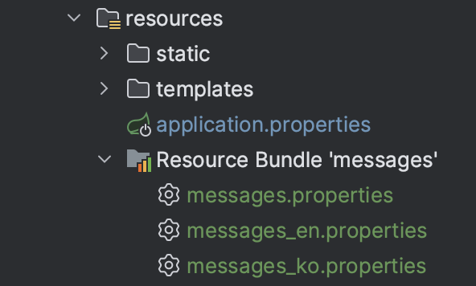
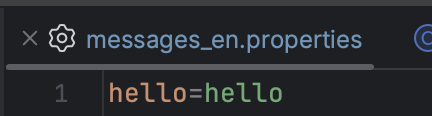
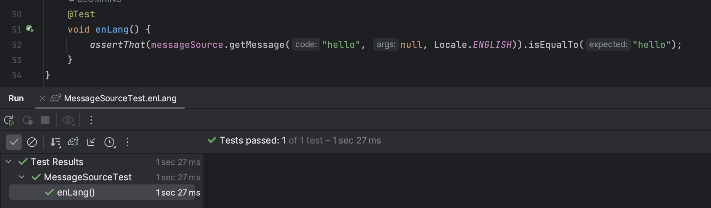

## Locale

국제화란 예를 들어, 우리나라뿐만이 아니라 미국에서도 웹 서비스를 제공하고 있다고 하자. 이런 상황에서는 우리나라에서 접근을 하면 한국어가 나와야 하고 미국에서 접근을 하면 영어를 보여주어야 한다.

이처럼 사용자의 언어, 국가를 고려하여 메시지를 다르게 제공하는 기능을 국제화라고 한다.

인텔리제이에서는 분기를 위해 위와 같이 프로퍼티 파일로 관리한다. 스프링 부트에서는 `messages`를 기본 네이밍으로 가져간다.

이를 변경하고 싶다면 application.properties 파일에 `spring.messages.basename={이름}` 을 넣어 변경할 수 있다.

