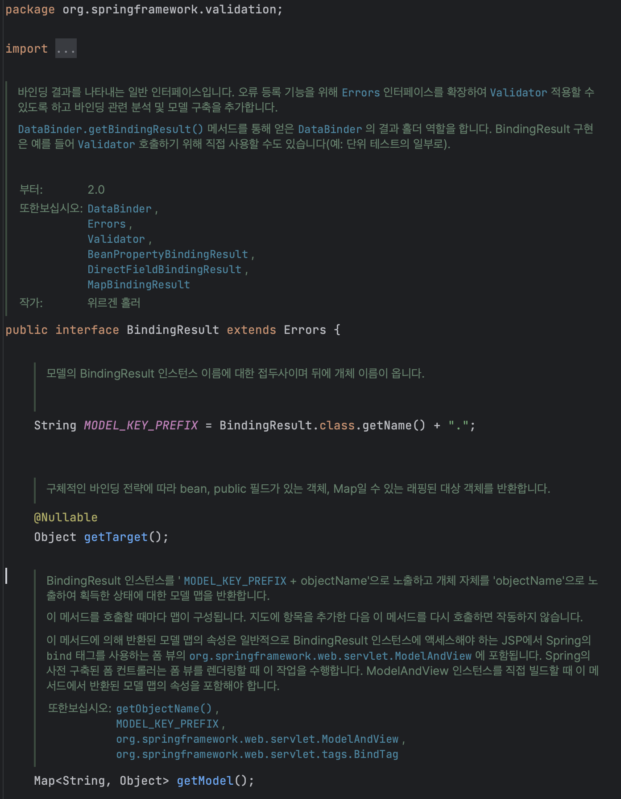

## Validation

> Spring 검증, 예외처리 시리즈의 1번째 포스팅입니다.
>
> SSR 방식을 기준으로 작성하였으며 API 방식은 다른 포스팅에 작성 예정입니다.

클라이언트에서 서버에 값을 보낼 때, 이 값을 검증할 수단이 필요하다. 잘못된 데이터는 애플리케이션의 장애를 유발할 수 있기 때문이다. 

거기에 더해 사용자에게 어떤 부분이 잘못된 요청인지 알려주어 사용성을 편하게 도와야 한다.

만약 프로젝트가 Layered Architechture로 되어있다면 이 Validation 로직은 대개 Controller에서 처리해야할 책임을 가지고 있다.

> 클라이언트에서 검증을 하면 서버에서 검증을 할 필요가 없지 않은가?
>
> - API 콜은 꼭 클라이언트 검증을 거치지 않을 수 있다. 
>
>   예를 들어, 악성 사용자가 웹 UI를 사용하지 않고 Postman 같은 툴을 이용하여 요청을 보낼 수도 있다.
>
>   이런 상황에서 서버에 검증 로직이 없다면 장애가 발생할 수 있다.
>
> - 서버에서만 처리할 수 있는 검증 로직이 있을 수 있다.
>
>   정확한 API 스펙 정의를 통해 어떤 예외가 발생했는지 클라이언트에 정보를 제공해야 한다.

### 예제

미리 완성해둔 코드 구현을 이용해서 각 객체들의 역할을 알아보겠다.


### @InitBinder, WebDataBinder

`@InitBinder`

컨트롤러에서 WebDataBinder를 초기화하는 메서드를 식별하는 애노테이션

컨트롤러로 들어오는 요청에 대해 추가적인 처리를 하고 싶을 때 사용할 수 있다.

모든 요청 전에 InitBinder를 선언한 메소드가 실행된다.

`WebDataBinder`

Validator 인터페이스를 포함해 컨트롤러에서 Validator의 검증 기능을 수행하는 객체

```java
@InitBinder
public void init(final WebDataBinder dataBinder) {
    dataBinder.addValidators(itemValidator);
}
```

여러 Validator를 등록해서 사용할 수 있다.

### Validator

객체애 대해 Validation을 수행하는 역할을 한다.

supports, validate 메서드를 구현해야 한다.

`supports`

위 WebDataBinder 객체에 여러 Validator를 추가할 수 있다.

여러 Validator가 등록된 경우 어떤 객체에 대한 Validator인지 구분하는 기능이 필요하다.

해당 객체의 인스턴스(혹은 슈퍼클래스)인지 확인한다.

`validate`

해당 객체에 대한 Validation 로직을 구현하는 메서드이다.

### @Validated

각 컨트롤러에서 관련 코드가 없는데 어떻게 Validation 대상이 되는 객체를 구분할 수 있을까?

이 의문을 해소해주는 것이 @Validated 애노테이션이다.

이 애노테이션이 붙으면 앞서 WebDataBinder에 등록한 Validator를 찾아서 실행한다.

비슷한 애노테이션으로 `@Valid` 가 있는데 이를 사용해도 동작한다. @Validated 는 스프링 전용 검증 애노테이션이고, @Valid 는 자바 표준 검증 애노테이션이다. 

### BindingResult (Errors)

가장 핵심이 되는 객체는 Errors를 상속받고 있는 BindingResult이다.



컨트롤러에서 BindingResult를 선언해두면 Validator 객체에서 구현한 validate 메서드에 바인딩되어 에러를 담는다.

여러 메서드가 있는데 이는 해당 객체 스펙을 참조하자.

### 정리

위의 애노테이션, 객체들이 유기적으로 동작하면서 Validation이 수행된다.

1. Item 객체에 대한 생성 요청

2. @InitBinder를 통해 WebDataBinder에 Validator 등록

3. @Validated로 WebDataBinder에 등록된 Validator를 찾아 validate 수행

   만약 Validator가 여러개라면 supports 메서드를 통해 구분

4. BindingResult에 에러 적재
5. 응답

순으로 로직이 수행된다.

