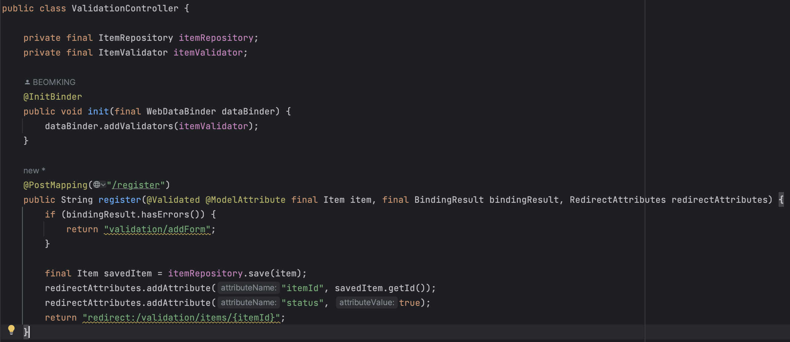

# Validation

## 목차

- [Validation](#Validation)
- [코드 기반의 Validation](#코드-기반의-Validation)
- [Bean Validation](#Bean-Validation)
- [결론](#결론)

클라이언트에서 서버에 값을 보낼 때, 이 값을 검증할 수단이 필요하다. 잘못된 데이터는 애플리케이션의 장애를 유발할 수 있기 때문이다. 

거기에 더해 사용자에게 어떤 부분이 잘못된 요청인지 알려주어 사용성을 편하게 도와야 한다.

만약 프로젝트가 계층형 아키텍처로 되어있다면 이 검증 로직은 대개 컨트롤러에서 처리해야할 책임을 가지고 있다.

> 클라이언트에서 검증을 하면 서버에서 검증을 할 필요가 없지 않은가?
>
> - API 콜은 꼭 클라이언트 검증을 거치지 않을 수 있다. 
>
>   예를 들어, 악성 사용자가 웹 UI를 사용하지 않고 Postman 같은 툴을 이용하여 요청을 보낼 수도 있다.
>
>   이런 상황에서 서버에 검증 로직이 없다면 장애가 발생할 수 있다.
>
> - 서버에서만 처리할 수 있는 검증 로직이 있을 수 있다.
>
>   정확한 API 스펙 정의를 통해 어떤 예외가 발생했는지 클라이언트에 정보를 제공해야 한다.

## 코드 기반의 Validation

이 부분은 검증을 수월하게 수행할 수 있도록 도와주는 [Bean Validation](##Bean-Validation)을 설명하기 전에  [Bean Validation](##Bean-Validation)이 나오기 전에는 어떤 식으로 검증을 구현했는지를 알아보는 파트이다.

 [Bean Validation](##Bean-Validation)은 애노테이션을 활용해 많은 구현을 생략하기 때문에 원리를 이해하는데 도움이 될 수 있다.




### @InitBinder, WebDataBinder

`@InitBinder`

컨트롤러에서 WebDataBinder를 초기화하는 메서드를 식별하는 애노테이션

컨트롤러로 들어오는 요청에 대해 추가적인 처리를 하고 싶을 때 사용할 수 있다.

모든 요청 전에 InitBinder를 선언한 메소드가 실행된다.

`WebDataBinder`

Validator 인터페이스를 포함해 컨트롤러에서 Validator의 검증 기능을 수행하는 객체

```java
@InitBinder
public void init(final WebDataBinder dataBinder) {
    dataBinder.addValidators(itemValidator);
}
```

여러 Validator를 등록해서 사용할 수 있다.

위의 예제의 경우 로컬 Validator의 경우이고 글로벌 Validator를 등록하는 방법도 있다.

### Validator

객체에 대해 Validation을 수행하는 역할을 한다.

supports, validate 메서드를 구현해야 한다.

`supports`

위 WebDataBinder 객체에 여러 Validator를 추가할 수 있다.

여러 Validator가 등록된 경우 어떤 객체에 대한 Validator인지 구분하는 기능이 필요하다.

해당 객체의 인스턴스(혹은 슈퍼클래스)인지 확인한다.

`validate`

해당 객체에 대한 Validation 로직을 구현하는 메서드이다.

### @Validated

각 컨트롤러에서 관련 코드가 없는데 어떻게 Validation 대상이 되는 객체를 구분할 수 있을까?

이 의문을 해소해주는 것이 @Validated 애노테이션이다.

이 애노테이션이 붙으면 앞서 WebDataBinder에 등록한 Validator를 찾아서 실행한다.

비슷한 애노테이션으로 `@Valid` 가 있는데 이를 사용해도 동작한다. @Validated 는 스프링 전용 검증 애노테이션이고, @Valid 는 자바 표준 검증 애노테이션이다. 

### BindingResult (Errors)

가장 핵심이 되는 객체는 Errors를 상속받고 있는 BindingResult이다.

컨트롤러에서 BindingResult를 선언해두면 Validator 객체(Validator 인터페이스를 상속받은)에서 구현한 validate 메서드에 바인딩되어 에러를 담는다.

---

위의 애노테이션, 객체들이 유기적으로 동작하면서 검증 로직이 수행된다.

1. 객체에 대한 생성 요청

2. @InitBinder를 통해 WebDataBinder에 Validator 등록

3. @Validated로 WebDataBinder에 등록된 Validator를 찾아 validate 수행

   만약 Validator가 여러개라면 supports 메서드를 통해 구분

4. BindingResult에 에러 적재
5. 응답

## Bean Validation

위 예시에서 보면 검증은 크게 필드와 오브젝트 대상으로 나뉜다.

```java
public class Item {
    private Long id;
    private String itemName;
    private Integer price;
    private Integer quantity;
}
```

대상이 필드일 경우, 'price 필드가 0 이하여서는 안된다', 'price 필드는 null이어서는 안된다.' 같은 제약을 어겼을 경우 필드 오류라고 한다.

대상이 오브젝트일 경우, 단독 필드 에러가 아닌 'price * quantity가 10000 이상이어야 한다.' 같은 비즈니스 규칙에 대한 오류를 오브젝트 오류라고 한다.

여기서 오브젝트 오류는 별도의 메서드를 작성하여 검증하는 것이 낫다. 

다만 필드 오류의 경우 그 개수가 많고 이러한 필드 오류를 처리하는 코드를 일일이 작성하는 것은 비효율적일 수 있다. [코드 기반의 Validation](##코드-기반의-Validation)을 이용하면 각 객체에 대한 Validator 객체를 만들고 등록하는 과정이 매번 필요하다.

이런 과정없이 편리하게 처리하도록 도와주는 것이 Bean Validation이다. 

> 스프링 부트의 기본 구현체는 Hibernate Validator이다. 자세한 내용은 [공식 문서](https://hibernate.org/validator/)를 참고하자.

스프링 부트는 아래 의존성을 추가해 사용할 수 있다.

```
// Maven
<dependency>
    <groupId>org.springframework.boot</groupId>
    <artifactId>spring-boot-starter-validation</artifactId>
</dependency>

// Gradle
implementation 'org.springframework.boot:spring-boot-starter-validation'
```

```java
@Getter
public class Item {
    private Long id;

    @NotBlank
    private String itemName;

    @NotNull
    @Range(min = 1000, max = 1000000)
    private Integer price;

    @NotNull
    @Max(9999)
    private Integer quantity;
}

// Controller 하위
@PostMapping
public Item signUp(@Valid @RequestBody final Item item) {
  // ..생략
}
```

코드 기반 Validation에서 작성했던 필드 오류를 처리하는 Validator 클래스와 컨트롤러에서 등록하던 DataBinder와 관련된 로직을 모두 없앨 수 있다. (오브젝트 오류에 대한 처리는 추후 설명)

이러한 변화에도 동일한 동작이 되는 이유는 스프링 부트가 spring-boot-starter-validation 라이브러리를 넣으면 자동으로 글로벌 Validator로 등록하기 때문이다.

> LocalValidatorFactoryBean을 글로벌 Validator로 등록하며 @NotNull 같은 애노테이션을 보고 검증을 수행한다. 
>
> 검증 오류가 발생하면 직접 구현한 Validator와 동일하게 필드 에러, 오브젝트 에러를 생성해서 BindingResult 에 담아준다. 
>
> (오브젝트 에러도 애노테이션으로 처리할 수 있긴한데 불편하다.)

### Messaging

아래는 패스워드의 사이즈로 8 ~ 20자리의 제약사항을 어겼을 때 발생하는 Binding이다.

한국어 디폴트 메시지

```
Field error in object 'memberCreateRequest' on field 'password': rejected value [1234123]; ..생략.. default message [크기가 8에서 20 사이여야 합니다]
```

영어 디폴트 메시지

```
Field error in object 'memberCreateRequest' on field 'password': rejected value [1234123]; ..생략.. default message [size must be between 8 and 20]
```

#### 메시징 사용 방식

1. 애노테이션 message 속성에 MessageSource를 이용하기

   ```java
   // MemberCreateRequest.class
   @NotBlank
   @Size(min = 8, max = 20, message = "{Size.password}")
   private String password;
   ```

   ```properties
   // application.properties
   spring.messages.basename=validation
   
   // validation.properties
   Size.password=메시징 소스 - 비밀번호는 {min}자 이상 {max}자 이하로 입력해 주세요.
   NotBlank=메시징 소스 - 공백을 입력할 수 없습니다.
   
   ```

2. 애노테이션의 message 속성에 직접 등록하기

   ```java
   // MemberCreateRequest.class
   @NotBlank
   @Size(message = "비밀번호는 {min} ~ {max}자리로 입력해주세요.")
   private String password;
   ```

3. 라이브러리가 제공하는 기본 값 사용 Ex. 크기가 8에서 20 사이여야 합니다

## 결론
코드 기반의 Validation보다 애노테이션 기반의 Bean Validation 방식으로 더 간결하게 개선할 수 있었다.

하지만 위에서 적용한 메시징이나 필드에 대한 정보는 현재 응답으로 받을 수 없다. 현재 기본 응답은 아래와 같다.

```json
{
    "timestamp": "2023-06-25T13:10:26.311+00:00",
    "status": 400,
    "error": "Bad Request",
    "path": "/members"
}
```

혹은 bindingResult.getAllErrors() 메서드를 통해 에러들만 응답으로 보내면 

```json
[
    {
        "codes": [
            "NotBlank.itemSaveForm.itemName",
            "NotBlank.itemName",
            "NotBlank.java.lang.String",
            "NotBlank"
        ],
        "arguments": [
            {
                "codes": [
                    "itemSaveForm.itemName",
                    "itemName"
                ],
                "arguments": null,
                "defaultMessage": "itemName",
                "code": "itemName"
            }
        ],
        "defaultMessage": "공백일 수 없습니다",
        "objectName": "itemSaveForm",
        "field": "itemName",
        "rejectedValue": null,
        "bindingFailure": false,
        "code": "NotBlank"
    }
]
```

위와 같은 결과를 얻을 수 있는데 불필요한 정보가 많이 담겨있기 때문에 기본 응답과 Errors 데이터를 담은 응답을 바로 사용할 순 없다.

이를 커스텀하여 별도의 API 스펙을 정의하여 에러 메시지를 공통화할 필요가 있다. [예외 처리 가이드](https://github.com/BEOMKING/spring-guide/blob/main/doc/exception-guide.md)

스프링 부트가 제공하는 간결한 검증 처리 방식을 알아보았다. 여기에 더해 예외 처리 공통화를 함께 사용하여 강력한 예외 처리 기능을 사용할 수 있을 것이다.
